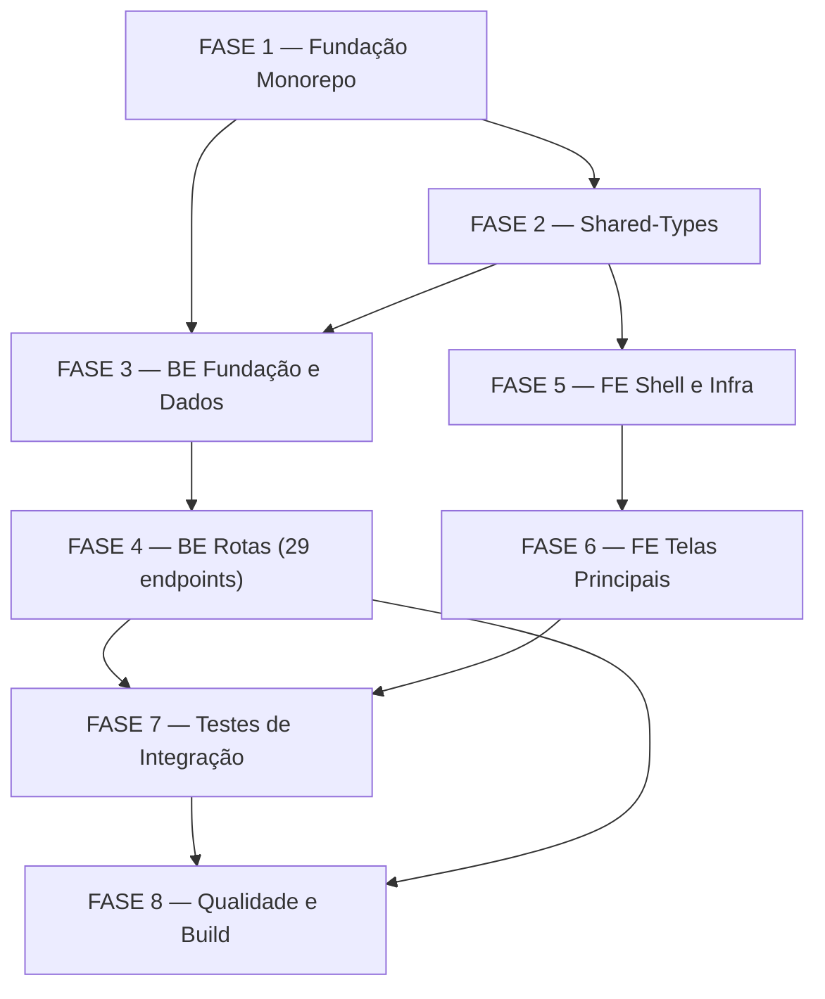

# Tarefas cstk-panel — Dashboard de Observabilidade Read-Only

Escopo: Monorepo Node.js + TypeScript com back-end Fastify 5 (read-only sobre
`knowledge.db` SQLite/FTS5 schema v2) e front-end React 19 + Vite 5. Inclui
pacote `shared-types`, 29 endpoints GET, 6 telas principais (Visão Geral,
Detalhe de Execução, Busca, Alertas, Métricas, Estados Degradados) e todos os
invariantes constitucionais (read-only, degradação, honestidade de métrica,
conteúdo UNTRUSTED, frescor de snapshot).

**Legenda de status:**
- `[ ]` Pendente
- `[~]` Em andamento
- `[x]` Concluído
- `[!]` Bloqueado

**Legenda de criticidade:**
- `[C]` Crítico — impacto direto na integridade de dados, segurança ou
  invariante constitucional NON-NEGOTIABLE
- `[A]` Alto — funcionalidade core sem a qual o painel não opera
- `[M]` Médio — necessário mas pode ser adiado sem impacto imediato no MVP

---

## FASE 1 — Fundação do Monorepo

> Objetivo: scaffolding completo, toolchain funcional, pacote `shared-types`
> compilando e instalado nos dois apps.

### 1.1 Scaffold do monorepo npm workspaces `[A]`

Ref: plan.md §Project Structure; spec.md FR-017 (localhost bind)

- [x] 1.1.1 Criar `package.json` raiz com `workspaces: ["apps/*", "packages/*"]`, scripts `dev`, `build`, `test`, `lint`
- [x] 1.1.2 Criar `tsconfig.base.json` raiz com `strict: true`, `moduleResolution: bundler`, `target: ES2022`
- [x] 1.1.3 Criar `packages/shared-types/package.json` com `name: "@cstk-panel/shared-types"`, exports e `main`
- [x] 1.1.4 Criar `apps/server/package.json` com dependências (`fastify`, `better-sqlite3`, `zod`, `@fastify/cors`, `@fastify/rate-limit`) e `@cstk-panel/shared-types` via workspace
- [x] 1.1.5 Criar `apps/web/package.json` com dependências (`react 19`, `vite 5`, `@tanstack/react-query`, `react-router-dom v6`, `zod`) e `@cstk-panel/shared-types` via workspace
- [x] 1.1.6 Rodar `npm install` na raiz e confirmar que workspaces resolvem sem conflito de versão — onda-007: 314 pkgs instalados, workspaces resolvem
- [x] 1.1.7 Criar `README.md` raiz com instruções de setup (dois comandos: `npm install` + `npm run dev`)

### 1.2 Configuração TypeScript por workspace `[A]`

Ref: plan.md §Technical Context; contracts/envelope.md

- [x] 1.2.1 Criar `packages/shared-types/tsconfig.json` estendendo `tsconfig.base.json`, `declaration: true`, `outDir: dist`
- [x] 1.2.2 Criar `apps/server/tsconfig.json` estendendo base, `module: CommonJS` (Node), `rootDir: src`, `outDir: dist`
- [x] 1.2.3 Criar `apps/web/tsconfig.json` estendendo base, `module: ESNext` (Vite/bundler), `jsx: react-jsx`
- [x] 1.2.4 Confirmar que `tsc --noEmit` passa sem erros em `shared-types` com os tipos iniciais — onda-007: exit 0, zero erros
- [x] 1.2.5 Adicionar `build` e `typecheck` scripts a cada workspace

### 1.3 Tooling: Vitest + ESLint + scripts utilitários `[M]`

Ref: plan.md §Technical Context; quickstart.md §Cenário 1

- [x] 1.3.1 Instalar `vitest` na raiz (workspace compartilhado) e criar `vitest.config.ts` base — configs criadas; install em block-001
- [x] 1.3.2 Configurar `vitest.config.ts` em `apps/server` (integração com DB real read-only, sem mock de DB)
- [x] 1.3.3 Instalar `eslint` + `@typescript-eslint` e criar `.eslintrc.cjs` raiz proibindo `dangerouslySetInnerHTML` (rule custom) e verbos SQL de mutação em `apps/server/src`
- [x] 1.3.4 Criar script `npm run lint:readonly-check` fazendo `grep -rniE '\b(INSERT|UPDATE|DELETE|CREATE|DROP|ALTER)\b' apps/server/src` (SC-003)
- [x] 1.3.5 Criar `apps/server/test/` com fixture `knowledge-fixture.db` (cópia minimal de `~/.claude/cstk/knowledge.db`) para testes de integração — onda-007: fixture criada (14 execucoes, 237 ondas, schema v2 OK)

---

## FASE 2 — Pacote Shared-Types (Contratos BE↔FE)

> Objetivo: definir DTOs, envelope padrão e schemas Zod compartilhados — fonte
> de verdade única para ambas as camadas. Paridade explícita com o schema v2.

### 2.1 Envelope padrão e tipos de metadados `[C]`

Ref: contracts/envelope.md; spec.md FR-023; data-model.md §Convenção de tipos

- [x] 2.1.1 Criar `packages/shared-types/src/envelope.ts` com `Freshness`, `Meta` (degraded, reason, freshness, schemaVersion, approximate?) e `ApiEnvelope<T>`
- [x] 2.1.2 Criar schema Zod correspondente `MetaSchema`, `ApiEnvelopeSchema<T>` em `packages/shared-types/src/schemas/envelope.ts`
- [x] 2.1.3 Garantir que `meta.freshness` tem `mtime` (ISO) + `maxIngestedAt` (ISO) — obrigatórios (FR-014)
- [x] 2.1.4 Garantir que `meta.degraded` é `boolean` obrigatório e `meta.reason` é `string | null`
- [x] 2.1.5 Teste unitário: `ApiEnvelopeSchema.parse(payload_valido)` passa; `parse(sem_degraded)` falha com ZodError — onda-007: 9 testes em envelope.test.ts

### 2.2 DTOs de domínio — entidades core `[C]`

Ref: data-model.md §Entities; spec.md §Key Entities; plan.md §Convenções de Borda

- [x] 2.2.1 Criar `packages/shared-types/src/entities.ts` com `ExecutionDTO` (camelCase, todos os campos de `data-model.md §Entity: Execution`)
- [x] 2.2.2 Adicionar `WaveDTO` ao mesmo arquivo (campos de `data-model.md §Entity: Wave`, incluindo `etapas: string` — NÃO array)
- [x] 2.2.3 Adicionar `DecisionDTO` (`score: 0|1|2|3|null`, campos textuais UNTRUSTED explicitados por comentário JSDoc `@untrusted`)
- [x] 2.2.4 Adicionar `TaskDTO` (`lintOk: boolean|null`, `arquivosTocadosCount: number|null` — NÃO array, cf. data-model.md)
- [x] 2.2.5 Adicionar `EventDTO`, `AlertSignalDTO`, `BloqueioDTO`, `SkillDTO`, `RetroDTO`, `FtsHitDTO` (com `rank: number`)
- [x] 2.2.6 Adicionar rollups: `ProjectRollup`, `FeatureRollup` (campos agregados para overview/projects/features)
- [x] 2.2.7 Adicionar tipos de request: `PaginationParams` (`limit: number`, `offset: number`), `PeriodParam` (union `'24h'|'7d'|'30d'|'all'`), `ScoreParam` (union `0|1|2|3`)

### 2.3 Schemas Zod para DTOs e paridade FE `[C]`

Ref: plan.md §Convenções de Borda; spec.md FR-012; quickstart.md §Cenário 1

- [x] 2.3.1 Criar `packages/shared-types/src/schemas/entities.ts` com schema Zod para cada DTO (parseando resposta real da API)
- [x] 2.3.2 Criar `packages/shared-types/src/schemas/params.ts` com schemas Zod para `PaginationParams`, `PeriodParam`, `ScoreParam`, `SearchParams`
- [x] 2.3.3 Criar `packages/shared-types/src/index.ts` reexportando todos os tipos e schemas
- [x] 2.3.4 **Paridade FE**: confirmar que `apps/web` importa tipos de `@cstk-panel/shared-types` diretamente — zero tipos redefinidos localmente em `apps/web/src/types/` — onda-009: confirmado, nenhuma pasta types/ criada, todos os DTOs importados de @cstk-panel/shared-types
- [x] 2.3.5 Teste de paridade smoke: script `test:parity` que instancia cada schema Zod com fixture real — onda-007: 21 testes em parity.test.ts (payloads sinteticos, todos os schemas)

---

## FASE 3 — Back-end: Fundação e Camada de Dados

> Objetivo: servidor Fastify 5 funcional, conexão read-only com degradação
> como estado de 1ª classe, camada de queries SQL e mappers.

### 3.1 Bootstrap do servidor Fastify 5 `[A]`

Ref: plan.md §Project Structure `apps/server`; spec.md FR-017, FR-019

- [x] 3.1.1 Criar `apps/server/src/index.ts` bootstrapando Fastify com `logger: true` e bind `127.0.0.1:<PORT>` (FR-017)
- [x] 3.1.2 Criar `apps/server/src/config.ts` resolvendo path do DB: config explícita > `$CSTK_KNOWLEDGE_DB` > padrão `~/.claude/cstk/knowledge.db` — canonicalização via `path.resolve` (FR-018)
- [x] 3.1.3 Registrar plugin CORS restrito à origem do front-end (`http://localhost:5173`) via `@fastify/cors` (FR-017)
- [x] 3.1.4 Registrar hook `onSend` global injetando `Content-Type: application/json` + `X-Content-Type-Options: nosniff` (FR-019)
- [x] 3.1.5 Teste de integração: servidor sobe, responde `GET /api/v1/health` com `200` e os headers obrigatórios presentes — onda-008: 7 testes em server-health.test.ts

### 3.2 Camada de abertura do banco — degradação de 1ª classe `[C]`

Ref: research.md §Decision 1, §Decision 8; spec.md FR-002, FR-005, FR-007

- [x] 3.2.1 Criar `apps/server/src/db/open.ts` retornando `{ ok: true, db }` ou `{ ok: false, reason: DegradedReason }` — **nunca lança** (Princípio II)
- [x] 3.2.2 Abrir com `new Database(path, { readonly: true, fileMustExist: false })` + `PRAGMA query_only = 1` (FR-002)
- [x] 3.2.3 Implementar `quick_check` na abertura: resultado `!== 'ok'` → `{ ok: false, reason: 'db-corrupt' }` (FR-007)
- [x] 3.2.4 Validar `schema_version === '2'` em `schema_meta`; divergência → `{ ok: false, reason: 'schema-mismatch' }`
- [x] 3.2.5 Tratar base ausente (`ENOENT`) → `{ ok: false, reason: 'db-missing' }` e tabela vazia por recurso → `reason: 'table-empty'`
- [x] 3.2.6 Criar `apps/server/src/db/freshness.ts`: `mtime` do arquivo via `fs.statSync` + `SELECT max(ingested_at) FROM executions`; retornar `Freshness` do shared-types
- [x] 3.2.7 Implementar ETag: `W/"<mtime_epoch>-<max_ingested_at>"` (research.md §Decision 7) em `apps/server/src/lib/etag.ts`
- [x] 3.2.8 Testes de integração para os 4 motivos de degradação: ausente, corrompida, schema-mismatch, tabela vazia — onda-008: 8 testes em open.test.ts + caminho feliz read-only

### 3.3 Camada de queries SQL read-only `[A]`

Ref: data-model.md §Entities; contracts/api-read.md; spec.md FR-001, FR-003

- [x] 3.3.1 Criar `apps/server/src/db/queries/executions.ts` com prepared statements read-only: list, get por id, rollup por project/feature
- [x] 3.3.2 Criar `apps/server/src/db/queries/waves.ts` com query por `execucao_id`
- [x] 3.3.3 Criar `apps/server/src/db/queries/decisions.ts` com query paginada por `execucao_id` com filtros `wave`, `etapa`, `score` (binding parametrizado)
- [x] 3.3.4 Criar `apps/server/src/db/queries/tasks.ts`, `events.ts`, `alerts.ts`, `bloqueios.ts`, `skills.ts` (queries por `execucao_id`)
- [x] 3.3.5 Criar `apps/server/src/db/queries/cross.ts` com queries cross-execução para `/alerts`, `/tasks`, `/events` — onda-008: listCrossAlerts, listCrossTasks, listCrossEvents com filtros parametrizados
- [x] 3.3.6 Criar `apps/server/src/db/queries/metrics.ts` com 8 queries de métricas agregadas (GROUP BY, date(), etc.) — onda-008: cost-over-time, throughput-by-stage, test-pass-rate, human-latency, clarify-resolution, decisions-by-score, execution-duration, depth-subagents
- [x] 3.3.7 Criar `apps/server/src/db/queries/overview.ts` com query de KPIs, alertas recentes, execuções em andamento, leaderboard, funil
- [x] 3.3.8 Auditoria de mutação: rodar lint `npm run lint:readonly-check` e confirmar 0 verbos de mutação (SC-003) — onda-007: OK, 0 verbos

### 3.4 Camada de mappers DB-row → DTO `[C]`

Ref: plan.md §Convenções de Borda; data-model.md §Convenção de tipos

- [x] 3.4.1 Criar `apps/server/src/mappers/execution.ts`: `snake_case` → `camelCase`, todos os campos de `ExecutionDTO`
- [x] 3.4.2 Criar `apps/server/src/mappers/wave.ts`: `etapas: string` — manter como string (NÃO converter para array)
- [x] 3.4.3 Criar `apps/server/src/mappers/decision.ts`: `score` como `0|1|2|3|null`, campos textuais UNTRUSTED preservados crus
- [x] 3.4.4 Criar `apps/server/src/mappers/task.ts`: `lint_ok: INTEGER 0/1` → `lintOk: boolean` via `=== 1`; `arquivos_tocados: INTEGER` → `arquivosTocadosCount: number` (contagem, NÃO array)
- [x] 3.4.5 Criar mappers para `event`, `alert_signal`, `bloqueio`, `skill`, `retro`, `fts_hit`
- [x] 3.4.6 Testes unitários dos mappers: `lint_ok=0` → `false`, `lint_ok=1` → `true`; `etapas` permanece string; `score=2` → `2`; campos UNTRUSTED não sofrem transformação — onda-007: 15/15 testes
- [x] 3.4.7 **Paridade round-trip**: parse com schema Zod de `shared-types` sobre saída de cada mapper — `safeParse(...).success === true` — onda-007: validado em 15 testes

### 3.5 Utilitários: envelope, paginação, FTS escaping, rate-limit `[A]`

Ref: contracts/envelope.md; contracts/search-fts.md; spec.md FR-012, FR-020, FR-023

- [x] 3.5.1 Criar `apps/server/src/lib/envelope.ts`: `wrap<T>(data: T, meta: Partial<Meta>, db): ApiEnvelope<T>` computando `freshness` e `schemaVersion` automaticamente
- [x] 3.5.2 Criar `apps/server/src/lib/pagination.ts`: parser Zod de `limit` (1..100) e `offset` (>=0) com defaults e teto (SC-008)
- [x] 3.5.3 Criar `apps/server/src/lib/fts.ts`: tokenizar input por whitespace, envolver cada token em `"token"` (aspas duplicando internas), juntar com espaço → query FTS5 safe (research.md §Decision 6)
- [x] 3.5.4 Registrar `@fastify/rate-limit` apenas na rota `/search` — limite leve (ex: 30 req/min por IP) (FR-020) — onda-008: implementado em search.ts via scoped plugin
- [x] 3.5.5 Testes unitários de `fts.ts`: `') OR 1=1 --'` → query FTS5 sem caracteres ativos; `'"aspas"'` → tokens quoted corretamente — onda-007: 13/13 testes

---

## FASE 4 — Back-end: Rotas (29 endpoints GET)

> Objetivo: todos os 29 endpoints do contrato api-read.md implementados,
> respondendo com envelope padrão, degradação de 1ª classe e ETag/304.

### 4.1 Rota de saúde e visão geral `[A]`

Ref: contracts/api-read.md §Saúde e visão geral; spec.md FR-005, FR-014; quickstart.md §Cenário 6

- [x] 4.1.1 Criar `apps/server/src/routes/health.ts`: `GET /health` sempre `200`, `{ ok, dbReachable, quickCheck, counts }`, com `meta.degraded` correto — onda-008
- [x] 4.1.2 Criar `apps/server/src/routes/overview.ts`: `GET /overview?period=` com KPIs (`toolCallsTotal` rotulado, nunca `$`/tokens), alertas recentes, execuções em andamento, leaderboard, funil — onda-008
- [x] 4.1.3 Hook `onRequest` global para If-None-Match/ETag → `304` quando ETag coincide (research.md §Decision 7) — onda-008: inline nas rotas via generateETag + etagMatches
- [x] 4.1.4 Testes de integração: `/health` com base ausente → `200 + meta.degraded=true + reason=db-missing`; `/overview` responde os campos de KPI esperados — onda-008: routes.test.ts

### 4.2 Rotas de projetos e features `[A]`

Ref: contracts/api-read.md §Projetos e features; spec.md FR-022 (drill-down)

- [x] 4.2.1 Criar `apps/server/src/routes/projects.ts`: `GET /projects` e `GET /projects/{project}` com rollup e features aninhadas — onda-008
- [x] 4.2.2 Criar `apps/server/src/routes/features.ts`: `GET /features?project=&status=` e `GET /features/{project}/{feature}` — onda-008
- [x] 4.2.3 Validar path params com Zod (string não-vazia, sem traversal — FR-018) — onda-008: regex /^[^/\\.<>]+$/ em todos os params
- [x] 4.2.4 Testes de integração: `/projects` com base real retorna lista; `/projects/unknown` retorna `200 + data: null + meta.degraded=false` (projeto inexistente ≠ degradação) — onda-008: routes.test.ts

### 4.3 Rotas de detalhe de execução e sub-recursos `[A]`

Ref: contracts/api-read.md §Execução; spec.md FR-004, FR-020; quickstart.md §Cenário 2

- [x] 4.3.1 Criar `apps/server/src/routes/executions.ts`: `GET /executions/{execucaoId}` (detalhe completo) — onda-008
- [x] 4.3.2 Adicionar `GET /executions/{execucaoId}/waves` (WavesTimeline) — onda-008
- [x] 4.3.3 Adicionar `GET /executions/{execucaoId}/decisions?wave=&etapa=&score=&limit=&offset=` paginado obrigatoriamente (FR-020, SC-008) — onda-008
- [x] 4.3.4 Adicionar `GET /executions/{execucaoId}/tasks`, `/events`, `/alerts`, `/bloqueios`, `/skills` — onda-008: 5 sub-recursos implementados
- [x] 4.3.5 Validar query params com Zod (score ∈ 0..3, limit ≤ 100, period ∈ 24h/7d/30d/all) — onda-008
- [x] 4.3.6 Testes de integração: decisões paginadas (`limit=5`) retornam exatamente 5 itens; `score=` filtra corretamente; campos UNTRUSTED chegam como string crua — onda-008: routes.test.ts (limit=5 test)

### 4.4 Rotas cross-execução e métricas `[M]`

Ref: contracts/api-read.md §Cross-execução e §Métricas; spec.md FR-008, FR-009; research.md §Decision 5

- [x] 4.4.1 Criar `apps/server/src/routes/alerts.ts`: `GET /alerts?tipo=&project=&feature=&period=` — onda-008
- [x] 4.4.2 Criar `apps/server/src/routes/tasks.ts` (cross): `GET /tasks?project=&feature=&outcome=` — onda-008
- [x] 4.4.3 Criar `apps/server/src/routes/events.ts` (cross): `GET /events?event_type=&project=&period=` — onda-008
- [x] 4.4.4 Criar `apps/server/src/routes/metrics.ts` com 8 endpoints: `cost-over-time` (agregado por dia, D5), `throughput-by-stage`, `test-pass-rate`, `human-latency`, `clarify-resolution` (`meta.approximate=true`), `decisions-by-score`, `execution-duration`, `depth-subagents` — onda-008
- [x] 4.4.5 Garantir que `cost-over-time` retorna `toolCalls` (nunca `$`/tokens) e que `clarify-resolution` tem `meta.approximate=true` (FR-009) — onda-008: verificado no código de metrics.ts e metrics.ts queries
- [x] 4.4.6 Testes de integração: `/metrics/cost-over-time` sem período retorna `all`; `/metrics/clarify-resolution` tem `meta.approximate=true` — onda-008: routes.test.ts

### 4.5 Rota de busca FTS5 `[A]`

Ref: contracts/search-fts.md; spec.md FR-012, FR-020; research.md §Decision 6; quickstart.md §Cenário 5

- [x] 4.5.1 Criar `apps/server/src/routes/search.ts`: `GET /search?q=&type=&project=&feature=&limit=&offset=` — onda-008
- [x] 4.5.2 Aplicar `lib/fts.ts` ao `q` antes de passar ao `MATCH ?` — binding parametrizado (nunca interpolação) — onda-008
- [x] 4.5.3 Incluir `rank` (bm25) em cada `FtsHit`; ordenar por relevância — onda-008: ORDER BY rank na query FTS5
- [x] 4.5.4 Aplicar rate-limit `@fastify/rate-limit` nesta rota (FR-020) — onda-008: 30 req/min por IP via scoped plugin
- [x] 4.5.5 Testes de integração com payloads hostis: `") OR 1=1 --"`, `"NEAR/3 (a b)"`, aspas não balanceadas → todos retornam `200` com `results` vazio ou com resultados, nunca `5xx` (SC-005) — onda-008: 6 casos hostis em routes.test.ts
- [x] 4.5.6 Teste: `q` com tamanho máximo excedido retorna `400` com mensagem descritiva (não expõe stack trace) — onda-008: routes.test.ts q_vazio + q>200chars

---

## FASE 5 — Front-end: Shell, Roteamento e Infraestrutura

> Objetivo: SPA funcional com shell pixel-perfect (sidebar 232px + topbar,
> dark-mode-first), roteamento, TanStack Query configurado e 4 estados
> transversais (loading/empty/error/degraded).

### 5.1 Shell da aplicação — pixel-perfect (dark-mode-first) `[A]`

Ref: spec.md FR-021; plan.md §Project Structure `apps/web`; quickstart.md §Setup step 3

- [x] 5.1.1 Criar `apps/web/src/styles/tokens.css` recriando design tokens do protótipo (`docs/06-ui-ux-design/castk-panel/`) — cores, tipografia, espaçamentos, sidebar width 232px — onda-009
- [x] 5.1.2 Criar `apps/web/src/App.tsx` com layout: sidebar fixo 232px + topbar + área de conteúdo, tema dark por padrão — onda-009
- [x] 5.1.3 Criar componente `Sidebar` com itens de navegação: Visão Geral, Execuções, Busca, Alertas, Métricas — onda-009
- [x] 5.1.4 Criar componente `Topbar` com breadcrumb navegável (FR-022) e seletor de período global — onda-009
- [ ] 5.1.5 Verificação visual lado a lado com protótipo de referência (`docs/06-ui-ux-design/castk-panel/`) — SC-006

### 5.2 Roteamento com React Router v6 (hash router) `[A]`

Ref: plan.md §Technical Context; spec.md FR-022 (drill-down ≤ 4 cliques, SC-004)

- [x] 5.2.1 Configurar `HashRouter` em `apps/web/src/main.tsx` (paridade com protótipo) — onda-009
- [x] 5.2.2 Definir rotas: `/` (Overview), `/projects/:project`, `/features/:project/:feature`, `/executions/:execucaoId`, `/executions/:execucaoId/decisions`, `/alerts`, `/search`, `/metrics` — onda-009
- [x] 5.2.3 Criar componente `Breadcrumb` derivando da URL corrente e mostrando hierarquia navegável (FR-022) — onda-009
- [ ] 5.2.4 Garantir ≤ 4 cliques de Overview até nível mais granular (decisão/tarefa/evento/alerta) — validar com mapa de cliques (SC-004)
- [ ] 5.2.5 Teste: navegar programaticamente Visão Geral → Projeto → Feature → Execução → Decisão em 4 cliques, confirmar breadcrumb reflete a hierarquia

### 5.3 TanStack Query — cliente de API tipado `[A]`

Ref: plan.md §Technical Context; spec.md FR-014, FR-016; quickstart.md §Cenário 1 e §Cenário 7

- [x] 5.3.1 Criar `apps/web/src/lib/query.ts` configurando `QueryClient` com `staleTime`, `retry` e `gcTime` adequados ao painel de observabilidade — onda-009
- [x] 5.3.2 Criar `apps/web/src/lib/api.ts` com função `fetchApi<T>(path, init?)` adicionando `If-None-Match` (armazenado via `ETag` da resposta anterior) e fazendo `safeParse` da resposta com schema Zod de `shared-types` — onda-009
- [x] 5.3.3 Tratar `304 Not Modified` em `fetchApi`: retornar dados do cache sem chamada ao servidor — onda-009
- [x] 5.3.4 Criar hooks `useOverview`, `useExecution`, `useWaves`, `useDecisions`, `useSearch`, `useAlerts`, `useMetrics` (um por recurso principal) — onda-009: lib/hooks.ts com 14 hooks
- [ ] 5.3.5 Teste: `fetchApi` com ETag salvo retorna `304` e não re-parseia o body (cenário 7 do quickstart)

### 5.4 Estados transversais — 4 estados por tela `[C]`

Ref: spec.md FR-006, FR-005; quickstart.md §Cenário 6

- [x] 5.4.1 Criar `apps/web/src/states/LoadingState.tsx` — skeleton animado por tela (FR-006) — onda-009
- [x] 5.4.2 Criar `apps/web/src/states/EmptyState.tsx` — "Nenhum dado disponível" sem erro (FR-006) — onda-009
- [x] 5.4.3 Criar `apps/web/src/states/ErrorState.tsx` — mensagem de erro amigável (nunca stack trace) — onda-009
- [x] 5.4.4 Criar `apps/web/src/states/DegradedBanner.tsx` — banner de topo com `meta.reason` + `freshness` quando `meta.degraded=true` (US6, FR-006) — onda-009
- [x] 5.4.5 Criar HOC / hook `useApiState` que resolve `{ isLoading, isEmpty, isError, isDegraded }` e retorna o estado correto — onda-009: hooks/useApiState.ts
- [ ] 5.4.6 Testes de renderização: cada estado renderiza sem crash; `DegradedBanner` aparece com `meta.degraded=true` e não aparece com `false`

### 5.5 Componentes atômicos reutilizáveis `[A]`

Ref: spec.md FR-021; data-model.md §Entities

- [x] 5.5.1 Criar `KpiCard` (valor, label, tendência opcional) — onda-009
- [x] 5.5.2 Criar `StatusBadge` (enum `status` de execução com cor) — onda-009
- [x] 5.5.3 Criar `ScoreChip` (score 0..3 com cor semântica: 0=vermelho, 3=verde) — onda-009
- [x] 5.5.4 Criar `OutcomePill` (`pass`/`fail` de Task) — onda-009
- [x] 5.5.5 Criar `FreshnessLabel` (exibe `mtime`/`maxIngestedAt` formatado como "há Xm") — onda-009
- [x] 5.5.6 Criar `TextRaw` — wrapper que renderiza campo UNTRUSTED como `textContent` puro (nunca `dangerouslySetInnerHTML`) (FR-011) — onda-009
- [ ] 5.5.7 Testes de snapshot: `TextRaw` com `` renderiza como texto literal visível, não executa (quickstart §Cenário 4)
- [x] 5.5.8 **Paridade de tipos FE**: confirmar que todos os componentes usam tipos importados de `@cstk-panel/shared-types` — zero tipos locais em `web/src/types/` que reproduzam DTOs — onda-009: confirmado, nenhum DTO local criado

---

## FASE 6 — Front-end: Telas Principais

> Objetivo: todas as 6 telas com drill-down funcional, pixel-perfect vs
> protótipo, e todos os 4 estados implementados por tela.

### 6.1 Tela Visão Geral (US1) `[A]`

Ref: spec.md §User Story 1, FR-008, FR-022; quickstart.md §Cenário 2, §Cenário 3

- [x] 6.1.1 Criar `apps/web/src/screens/Overview.tsx` usando hook `useOverview(period)`
- [x] 6.1.2 Exibir grid de KPIs: execuções em andamento, alertas críticos, custo ("proxy: tool calls"), taxa de conclusão
- [x] 6.1.3 Exibir lista de alertas recentes com drill-down para a execução/onda de origem
- [x] 6.1.4 Exibir leaderboard de execuções e funil de etapas
- [x] 6.1.5 Seletor de período (24h / 7d / 30d / tudo) que refaz queries ao mudar
- [x] 6.1.6 Confirmar que nenhum rótulo de custo usa `$`/`USD`/`tokens` (SC-002)
- [x] 6.1.7 Aplicar 4 estados (loading/empty/error/degraded) — skeleton enquanto carrega, `DegradedBanner` se `meta.degraded`

### 6.2 Tela Detalhe de Execução e WavesTimeline (US2) `[A]`

Ref: spec.md §User Story 2, FR-011; quickstart.md §Cenário 4

- [x] 6.2.1 Criar `apps/web/src/screens/ExecutionDetail.tsx` com detalhe da execução + tabs (Ondas, Decisões, Tarefas, Eventos, Alertas, Bloqueios, Skills)
- [x] 6.2.2 Implementar `WavesTimeline`: cada onda como card com etapa, duração, `tool_calls`, `motivo_termino`
- [x] 6.2.3 Implementar lista de Decisões paginada e filtrável por onda/etapa/score (FR-020, SC-008)
- [x] 6.2.4 Renderizar campos UNTRUSTED (`contexto`, `justificativa`, `evidência`) via `TextRaw` — nunca `dangerouslySetInnerHTML` (FR-011)
- [x] 6.2.5 Evidência renderizada em fonte mono (campo UNTRUSTED de fonte técnica)
- [x] 6.2.6 Aplicar 4 estados por tab
- [x] 6.2.7 Teste: campo `justificativa` com `<b>bold</b>` aparece como texto literal, não como HTML formatado (quickstart §Cenário 4)

### 6.3 Tela Busca de Conhecimento FTS5 (US3) `[A]`

Ref: spec.md §User Story 3, FR-012; quickstart.md §Cenário 5

- [x] 6.3.1 Criar `apps/web/src/screens/Search.tsx` com campo de busca, filtros (type, project, feature) e lista de resultados paginada
- [x] 6.3.2 Resultados ordenados por `rank` (bm25); cada resultado com `body` via `TextRaw` + link para fonte (decisão/onda/execução)
- [x] 6.3.3 Debounce de entrada (300ms) para não disparar rate-limit por keystroke
- [x] 6.3.4 Estado de "Nenhum resultado" distinto de erro (Empty vs Error)
- [x] 6.3.5 Teste de UI: query com parênteses/aspas não exibe erro de UI; estado empty aparece para query sem resultados

### 6.4 Tela Central de Alertas (US4) `[M]`

Ref: spec.md §User Story 4; contracts/api-read.md §Cross-execução

- [x] 6.4.1 Criar `apps/web/src/screens/Alerts.tsx` com lista de alertas filtráveis por tipo, project, feature, período
- [x] 6.4.2 Exibir severidade derivada de `valorConsumido/valorThreshold` com rótulo "derivada" (FR-009)
- [x] 6.4.3 Componente `BudgetGauge` (mini-gráfico de gauge para progresso threshold)
- [x] 6.4.4 Drill-down: clique num alerta navega para a execução/onda de origem (FR-022)
- [x] 6.4.5 Aplicar 4 estados

### 6.5 Tela Métricas Agregadas (US5) `[M]`

Ref: spec.md §User Story 5, FR-008, FR-009; research.md §Decision 5

- [x] 6.5.1 Criar `apps/web/src/screens/Metrics.tsx` com 8 gráficos/tabelas, uma por métrica
- [x] 6.5.2 `cost-over-time`: série temporal por dia, eixo-y rotulado "proxy: tool calls" (SC-002)
- [x] 6.5.3 `clarify-resolution`: card com badge "derivada/aproximada" visível (`meta.approximate=true`) (FR-009)
- [x] 6.5.4 Card "Indisponível nesta fonte" para mix de modelos — Princípio IV, D3 Opção A
- [x] 6.5.5 Seletor de período aplicado a todas as séries temporais
- [x] 6.5.6 Aplicar 4 estados

### 6.6 Tela / Estados Degradados de 1ª Classe (US6) `[C]`

Ref: spec.md §User Story 6, FR-005, FR-006; quickstart.md §Cenário 6

- [x] 6.6.1 Confirmar que `DegradedBanner` é renderizado em **todas** as telas quando `meta.degraded=true` (transversal — não por tela individual)
- [x] 6.6.2 Banner exibe `meta.reason` legível (`db-missing`, `db-corrupt`, `schema-mismatch`) + timestamp de frescor
- [x] 6.6.3 Tela de Overview com base ausente: `DegradedBanner` + KPIs vazos tipados, sem crash (SC-001)
- [x] 6.6.4 Skeleton de carregamento antes dos dados chegarem — nunca tela em branco (FR-006)
- [x] 6.6.5 Teste E2E: apontar `CSTK_KNOWLEDGE_DB=/tmp/nao-existe.db`, abrir todas as 5 telas — todas renderizam com `DegradedBanner` visível e sem erro de console (SC-001)

---

## FASE 7 — Testes de Integração e Roundtrip Real

> Objetivo: cobertura de testes que validam paridade de payload real
> (não mocks), FTS5 hostil, read-only absoluto e snapshot que muda.

### 7.1 Roundtrip End-to-End real (Vitest integração) `[C]`

Ref: quickstart.md §Cenário 1; plan.md §Convenções de Borda; spec.md SC-003

- [ ] 7.1.1 Criar `apps/server/test/roundtrip.test.ts`: servidor real + base real, `GET /overview?period=7d`, parse com `ApiEnvelopeSchema` de `shared-types` — sem mock de DB
- [ ] 7.1.2 Confirmar que todas as chaves retornadas estão em camelCase (`toolCallsTotal`, não `tool_calls_total`) — teste de paridade de convenção de borda
- [ ] 7.1.3 Confirmar `meta.schemaVersion === "2"` e `meta.degraded === false` na base real
- [ ] 7.1.4 Fazer `GET /search?q=plan&limit=5` com base real, confirmar shape de `FtsHitDTO` com `safeParse`
- [ ] 7.1.5 Testar ETag/304: segunda chamada com `If-None-Match` retorna `304` sem body

### 7.2 Testes de degradação `[C]`

Ref: quickstart.md §Cenário 6; spec.md SC-001, FR-005

- [ ] 7.2.1 Criar `apps/server/test/degradation.test.ts` com helpers para apontar para base inexistente, corrompida e com schema v1
- [ ] 7.2.2 Todos os 5 endpoints principais (`/health`, `/overview`, `/decisions`, `/search`, `/alerts`) respondem `200` com `meta.degraded=true` e shape válido para cada motivo de degradação
- [ ] 7.2.3 Confirmar que nenhum `5xx` é emitido por condição de dado

### 7.3 Testes de segurança e read-only `[C]`

Ref: quickstart.md §Cenário 5 e §Cenário 8; spec.md SC-003, SC-005

- [ ] 7.3.1 `apps/server/test/readonly.test.ts`: `grep -rniE` em `apps/server/src` — 0 verbos de mutação (SC-003); teste falha se encontrar algum
- [ ] 7.3.2 Confirmar abertura da conexão com `readonly: true` + `PRAGMA query_only` (inspecionar `open.ts`)
- [ ] 7.3.3 `apps/server/test/fts-hostile.test.ts`: payloads `") OR 1=1 --"`, `"'single"`, `"NEAR/3(a b)"`, `"; DROP TABLE"` — todos retornam `200`, nunca `5xx`
- [ ] 7.3.4 Payload de tamanho máximo excedido na busca → `400` sem stack trace

### 7.4 Testes de paridade de tipos (shared-types ↔ payload real) `[C]`

Ref: plan.md §Convenções de Borda; quickstart.md §Cenário 1

- [ ] 7.4.1 Criar `packages/shared-types/test/parity.test.ts`: para cada DTO, criar fixture de payload real (cópia direta de resposta da API) e confirmar `safeParse(...).success === true`
- [ ] 7.4.2 Testar `TaskDTO`: `arquivosTocadosCount` é `number` (não array), `lintOk` é `boolean`
- [ ] 7.4.3 Testar `WaveDTO`: `etapas` é `string` (não array)
- [ ] 7.4.4 Teste de regressão: modificar um campo para `snake_case` no fixture → `safeParse` deve falhar (garante que o teste não é trivial)

### 7.5 Testes de snapshot que muda (frescor) `[A]`

Ref: quickstart.md §Cenário 7; spec.md FR-014, FR-016, SC-007

- [ ] 7.5.1 `apps/server/test/freshness.test.ts`: `touch` na base fixture → nova requisição retorna `mtime` avançado
- [ ] 7.5.2 ETag antigo não retorna `304` após `touch` na base
- [ ] 7.5.3 Confirmar que `maxIngestedAt` avança quando `ingested_at` mais recente é inserido na fixture (cenário simulado)

---

## FASE 8 — Qualidade, Build e Documentação Final

> Objetivo: pipeline de build funcional, relatório de lint/auditoria,
> verificação de pixel-perfect e documentação de operação.

### 8.1 Build de produção e scripts de início `[A]`

Ref: plan.md §Project Structure; research.md §Decision 4; quickstart.md §Setup

- [ ] 8.1.1 Configurar `apps/server` build com `tsc` (saída em `dist/`) e script `start` lendo `CSTK_KNOWLEDGE_DB`
- [ ] 8.1.2 Configurar `apps/web` build com Vite (`npm run build` → `dist/`)
- [ ] 8.1.3 Criar script raiz `npm run dev` que inicia ambos em paralelo (ex: `concurrently`)
- [ ] 8.1.4 Verificar que `npm run build` na raiz compila `shared-types` → `server` → `web` em ordem correta de dependências
- [ ] 8.1.5 Documentar em `quickstart.md` os dois comandos de arranque: dev e produção

### 8.2 Auditoria final de invariantes constitucionais `[C]`

Ref: spec.md §Constitution Check; plan.md §Re-check; spec.md SC-001..SC-008

- [ ] 8.2.1 Executar `npm run lint:readonly-check` → 0 verbos de mutação em `apps/server/src` (SC-003)
- [ ] 8.2.2 Confirmar que nenhum endpoint não-`GET` existe: `grep -rn 'router\.\(post\|put\|patch\|delete\)' apps/server/src` → 0 resultados
- [ ] 8.2.3 Confirmar que nenhum `$`/`USD`/`token` aparece em DTOs ou componentes FE: `grep -rni '\b(USD|tokens\b|\$[0-9])' apps/` → 0 resultados (SC-002)
- [ ] 8.2.4 Confirmar `dangerouslySetInnerHTML` ausente: `grep -rn 'dangerouslySetInnerHTML' apps/web/src` → 0 resultados (FR-011)
- [ ] 8.2.5 Rodada completa de testes Vitest (`npm test`) com 0 falhas
- [ ] 8.2.6 Revisão visual lado a lado: cada tela vs protótipo de referência em `docs/06-ui-ux-design/castk-panel/` — pixel-perfect nas telas principais (SC-006)

### 8.3 Documentação final e gancho futuro `[M]`

Ref: research.md §Decision 4; plan.md §Próximos Passos

- [ ] 8.3.1 Atualizar `README.md` raiz com pré-requisitos, variáveis de ambiente (`CSTK_KNOWLEDGE_DB`, `PORT`) e instrução de uso com base real
- [ ] 8.3.2 Documentar no `README.md` o gancho futuro `cstk panel serve` (D4 — aditivo, não bloqueante)
- [ ] 8.3.3 Criar `CONTRIBUTING.md` mínimo com: como rodar testes, como checar read-only, como verificar paridade de tipos

---

## Matriz de Dependências

> **Caminho crítico**: F1 → F2 → F3 → F4 → F7 → F8 (back-end first).
> F5/F6 (front-end) pode ser paralelizado após F2.
> F7 (testes de integração) exige F4 + F6 completos.

---

## Resumo Quantitativo

| Fase | Tarefas | Subtarefas | Criticidade dominante |
|------|---------|------------|----------------------|
| 1 — Fundação Monorepo | 3 | 17 | [A] |
| 2 — Shared-Types | 3 | 15 | [C] |
| 3 — BE Fundação e Dados | 5 | 37 | [C]/[A] |
| 4 — BE Rotas | 5 | 26 | [A]/[M] |
| 5 — FE Shell e Infra | 5 | 30 | [C]/[A] |
| 6 — FE Telas Principais | 6 | 36 | [C]/[A]/[M] |
| 7 — Testes Integração | 5 | 21 | [C]/[A] |
| 8 — Qualidade e Build | 3 | 14 | [C]/[M] |
| **Total** | **35** | **196** | — |

---

## Escopo Coberto

| Item | Descrição | Fase |
|------|-----------|------|
| US1 | Visão Geral / Portfólio com drill-down | 6.1 |
| US2 | Detalhe de Execução com WavesTimeline e Decisões | 6.2 |
| US3 | Busca FTS5 ranqueada por bm25 | 4.5 / 6.3 |
| US4 | Central de Alertas cross-execução | 4.4 / 6.4 |
| US5 | Métricas Agregadas (8 métricas) | 4.4 / 6.5 |
| US6 | Estados Degradados de 1ª Classe em todas as telas | 5.4 / 6.6 |
| FR-001..FR-023 | Todos os 23 requisitos funcionais da spec | Fases 2–7 |
| SC-001..SC-008 | Todos os 8 critérios de sucesso | Fases 7–8 |
| Constitution I–VI | Todos os 6 princípios MUST (read-only, degradação, honestidade, não-reimplementar, UNTRUSTED, frescor) | Transversal |
| Paridade shared-types | DTOs únicos em `packages/shared-types`, consumidos por BE e FE sem redefinição | 2 / 5.5.8 |
| Convenções de Borda | snake_case SQLite → camelCase DTO → API JSON → FE TS, mappers explícitos | 3.4 |
| Roundtrip E2E real | Teste com payload real (não mock) para detectar drift de case | 7.1 |

---

## Escopo Excluído

| Item | Descrição | Motivo |
|------|-----------|--------|
| Autenticação / RBAC | Sem auth no MVP | spec.md FR-017: "sem autenticação/RBAC reais no MVP"; uso ferramental/individual |
| Mix de modelos | Sem reimplementação nem delegação via subprocesso | Constitution Princípio IV; D3 Opção A (research.md); exibiria "indisponível nesta fonte" |
| Árvore de decisões (skill decision-tree) | O painel delega à skill; não reimplementa | Constitution Princípio IV; FR-010 |
| Reindex (`cstk recall --reindex`) | Dono externo — painel nunca chama `--reindex` | spec.md FR-003; Constitution I |
| Escrita em `state.json` | Painel é consumidor derivado; `state.json` fora do escopo | spec.md FR-003; Constitution I |
| Subcomando `cstk panel serve` | Evolução futura; MVP é monorepo standalone | research.md §Decision 4 (D4) |
| Playwright E2E | Opcional — smoke manual ou fixture Vitest cobrem o essencial | plan.md "Playwright opcional" |
| Container / Docker | Sem container obrigatório no MVP | plan.md §Technical Context |
| Deploy em cloud / CI/CD | Uso local/ferramental no MVP | spec.md FR-017 (localhost por padrão) |
| Dados em tempo real / WebSocket | Base é snapshot reconstruível; polling por `ETag`/304 suficiente | Constitution VI; sem requisito de push |
