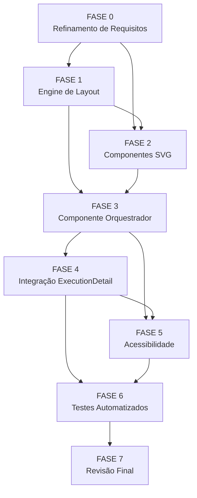

# Backlog: Decision Map Panel

**Escopo**: Habilitar o botão "Árvore de decisões" na tela `ExecutionDetail`
com mapa visual interativo de decisões — SVG manual, layout JS puro, painel
lateral de detalhe, zero dependências externas, zero endpoints novos.

**Spec**: [spec.md](spec.md) | **Plan**: [plan.md](plan.md)
**Criado**: 2026-05-29

---

## Legendas

| Status | Símbolo |
|--------|---------|
| Pendente | `[ ]` |
| Concluído | `[x]` |
| Bloqueado | `[~]` |

| Criticidade | Tag | Critério |
|-------------|-----|----------|
| Crítico | `[C]` | Impacto de segurança, integridade de dados ou SLA |
| Alto | `[A]` | Funcionalidade core sem a qual a feature não entrega valor |
| Médio | `[M]` | Necessário mas adiável sem impacto imediato no MVP |

---

## FASE 0 — Refinamento de Requisitos (Gaps do Checklist)

> Fecha os gaps revelados pelos checklists `ux.md` e `requirements.md` antes
> da implementação. Tarefas de resolução de spec, não de código.

### 0.1 Resolver ambiguidades e conflitos bloqueantes [A]

Ref: checklists/requirements.md CHK049, CHK054; checklists/ux.md CHK017

- [x] 0.1.1 Decidir: dono do estado `mapVisible` — `DecisionMapPanel` ou `ExecutionDetail`; atualizar plan.md §Modificação com a decisão (CHK049)
- [x] 0.1.2 Decidir: mecanismo de retry após erro de API — botão "Tentar novamente" explícito ou retry automático pelo TanStack Query; registrar em spec §FR-008 (CHK054)
- [x] 0.1.3 Decidir: "navegação por setas" em FR-010 — apenas Tab ou Tab + Arrow keys com `onKeyDown`; atualizar plan §Acessibilidade (CHK017)
- [x] 0.1.4 Verificar que plan.md §Edge Cases clarifica "progressivamente ou paginado" como `limit=100` + banner (CHK044)

### 0.2 Documentar gaps de acessibilidade e UX [A]

Ref: checklists/ux.md CHK021, CHK022, CHK023, CHK027, CHK034

- [x] 0.2.1 Definir: foco inicial ao abrir o mapa — primeiro nó ou container; adicionar à spec §FR-010 (CHK021)
- [x] 0.2.2 Definir: retorno de foco ao fechar painel lateral — nó selecionado ou botão toggle; adicionar à spec §FR-010 (CHK022)
- [x] 0.2.3 Definir: Tab order entre botão toggle → nós → painel → botão fechar; adicionar à spec §FR-010 (CHK023)
- [x] 0.2.4 Definir: comportamento dos botões prev/next nos extremos — disabled ou ocultos; adicionar ao plan §DecisionDetailPane (CHK027)
- [x] 0.2.5 Definir: fallback visual do nó quando `escolha = null` — placeholder "—" ou label "sem escolha"; adicionar à spec §FR-003 (CHK034)

### 0.3 Documentar gaps de layout e compatibilidade [M]

Ref: checklists/ux.md CHK006, CHK007; checklists/requirements.md CHK055, CHK059, CHK060

- [x] 0.3.1 Definir: altura máxima do SVG e overflow — scroll interno (`overflow: auto`) ou altura livre; adicionar ao plan §decision-map-layout.ts (CHK006, CHK007)
- [x] 0.3.2 Documentar: gatilho de reset do estado do mapa ao trocar execução via useEffect com `execucaoId` como dep; adicionar à spec §Edge Cases (CHK055)
- [x] 0.3.3 Verificar: `useDecisions` retorna dados em ordem wave+posição ou requer sort no cliente; documentar como premissa em plan §Convencoes de Borda (CHK059)
- [x] 0.3.4 Documentar: compatibilidade com tema claro via tokens CSS existentes (`var(--bg-*)`, `var(--text-*)`) — não requer trabalho extra se tokens forem usados consistentemente (CHK060)
- [x] 0.3.5 Fechar CHK040 como won't-fix explícito: performance do computeLayout (JS puro, <1ms para 100 nós) não justifica budget separado; registrar decisão inline

---

## FASE 1 — Engine de Layout (sem UI)

> Módulo TypeScript puro que converte `DecisionDTO[]` → `MapLayout`. Zero
> dependências de React/DOM. Testável em isolamento.

### 1.1 Implementar `decision-map-layout.ts` [A]

Ref: spec §FR-002, FR-005; plan §decision-map-layout.ts; data-model §Entity MapNode, §LayoutConfig

- [x] 1.1.1 Criar `apps/web/src/lib/decision-map-layout.ts` com interfaces `MapNode`, `MapEdge`, `MapLayout`
- [x] 1.1.2 Implementar constantes de layout: NODE_WIDTH=200, NODE_HEIGHT=72, COL_GAP=48, ROW_GAP=12, HEADER_Y=28, PADDING=16
- [x] 1.1.3 Implementar `computeLayout(items: DecisionDTO[]): MapLayout` — agrupar por wave, calcular x/y de cada nó, gerar chave `${wave}::${index}`
- [x] 1.1.4 Implementar geração de arestas: par consecutivo no array flat → `MapEdge { from, to }`
- [x] 1.1.5 Garantir `computeLayout([])` retorna `{ nodes: [], edges: [], svgWidth: 0, svgHeight: 0 }` sem erro
- [x] 1.1.6 Garantir `computeLayout` é função pura (sem side effects, sem estado global)

### 1.2 Testes unitários do engine de layout [A]

Ref: plan §Fase 1; spec §SC-002

- [x] 1.2.1 Criar `apps/web/src/lib/decision-map-layout.test.ts`
- [x] 1.2.2 Caso: array vazio → svgWidth=0, svgHeight=0, nodes=[], edges=[]
- [x] 1.2.3 Caso: 1 decisão (1 nó, 0 arestas) → nó em posição PADDING,HEADER_Y+PADDING; nenhuma aresta
- [x] 1.2.4 Caso: 3 decisões, 1 onda → 3 nós na mesma coluna, 2 arestas consecutivas
- [x] 1.2.5 Caso: 4 decisões, 2 ondas (2+2) → 2 colunas; chave `${wave}::0` e `${wave}::1` para cada onda
- [x] 1.2.6 Caso: 100 decisões, 10 ondas → `nodes.length === 100`, `edges.length === 99`
- [x] 1.2.7 Caso: nó com `escolha = null` → chave gerada sem erro, decision referenciada
- [x] 1.2.8 Executar `vitest run apps/web/src/lib/decision-map-layout.test.ts` — deve passar 100%

---

## FASE 2 — Componentes SVG (sem integração)

> Componentes React que renderizam o SVG e o painel lateral. Sem conexão com
> a query de dados — recebem tudo via props.

### 2.1 Implementar `DecisionMapNode.tsx` [A]

Ref: plan §DecisionMapNode; spec §FR-003, FR-004; data-model §Entity MapNode

- [x] 2.1.1 Criar `apps/web/src/components/DecisionMapNode.tsx`
- [x] 2.1.2 Renderizar `escolha` via `<TextRaw maxLength={40} />` — nunca innerHTML (spec §FR-007)
- [x] 2.1.3 Renderizar `<ScoreChip score={decision.score} />` com cor semântica (spec §FR-003)
- [x] 2.1.4 Renderizar rótulo da onda em monospace (text-3)
- [x] 2.1.5 Implementar fallback para `escolha = null` conforme decisão da tarefa 0.2.5
- [x] 2.1.6 Aplicar estilo visual para estado `selected` (borda/sombra conforme decisão da tarefa 0.1.4 / CHK012)
- [x] 2.1.7 Aplicar estilo visual para estado `focused` (ring de foco visível — acessibilidade)
- [x] 2.1.8 Usar tokens CSS existentes (`var(--bg-*)`, `var(--text-*)`, `var(--border-*)`) — compatibilidade tema claro (CHK060)

### 2.2 Implementar `DecisionMapSvg.tsx` [A]

Ref: plan §DecisionMapSvg; spec §FR-002, FR-005, FR-010; data-model §Invariantes

- [x] 2.2.1 Criar `apps/web/src/components/DecisionMapSvg.tsx`
- [x] 2.2.2 Definir `<defs><marker id="arrow">` para seta direcional nas arestas (spec §FR-005)
- [x] 2.2.3 Renderizar rótulos de onda via `<text>` acima de cada coluna (plan §DecisionMapSvg)
- [x] 2.2.4 Renderizar arestas como `<path>` com `marker-end="url(#arrow)"` — antes dos nós (z-order)
- [x] 2.2.5 Renderizar nós via `<g>` + `<foreignObject>` + `<DecisionMapNode>` por chave
- [x] 2.2.6 Adicionar `tabIndex={0}`, `role="button"`, `aria-label={decision.escolha}` em cada `<g>` (spec §FR-010)
- [x] 2.2.7 Implementar `onKeyDown` no `<g>`: Enter/Espaço → `onNodeSelect(key)` (spec §FR-010)
- [x] 2.2.8 Adicionar `role="img"` + `aria-label="Mapa de decisões"` no `<svg>` (plan §Acessibilidade)
- [x] 2.2.9 Implementar overflow/scroll conforme decisão da tarefa 0.3.1 (CHK006, CHK007)
- [x] 2.2.10 Garantir zero uso de `innerHTML` ou `dangerouslySetInnerHTML` (data-model §Invariantes)

### 2.3 Implementar `DecisionDetailPane.tsx` [A]

Ref: plan §DecisionDetailPane; spec §FR-006, FR-007, US2, US4 SC3

- [x] 2.3.1 Criar `apps/web/src/components/DecisionDetailPane.tsx`
- [x] 2.3.2 Renderizar `escolha` como título via `<TextRaw>` (spec §FR-007)
- [x] 2.3.3 Renderizar chips de opções com `chosenOptionIndex` — padrão do DecisionsPanel existente (plan §DecisionDetailPane)
- [x] 2.3.4 Renderizar `contexto`, `justificativa` via `<TextRaw>` (spec §FR-007)
- [x] 2.3.5 Renderizar `evidencia` via `<TextRaw>` em bloco monospace (spec §FR-007)
- [x] 2.3.6 Renderizar `etapa`, `wave`, `agente`, `score` via `<ScoreChip>` (spec §FR-006)
- [x] 2.3.7 Exibir apenas campos com valor — sem áreas vazias flutuando (spec §Edge Cases)
- [x] 2.3.8 Implementar botões prev/next para navegação no array flat (spec §US4 SC3)
- [x] 2.3.9 Desabilitar/ocultar botão prev na primeira decisão e next na última (tarefa 0.2.4 / CHK027)
- [x] 2.3.10 Implementar foco de retorno ao fechar painel (conforme decisão 0.2.2 / CHK022)
- [x] 2.3.11 Implementar fechamento por Escape via `onKeyDown` (spec §FR-010)
- [x] 2.3.12 Implementar botão "X" de fechar explícito

---

## FASE 3 — Componente Orquestrador

> `DecisionMapPanel` integra query, layout engine, SVG e painel lateral.
> Implementa todos os estados do mapa (loading, empty, error, degraded, normal).

### 3.1 Implementar `DecisionMapPanel.tsx` [A]

Ref: plan §DecisionMapPanel; spec §FR-008, FR-009, FR-012; data-model §Entity DecisionMapState

- [x] 3.1.1 Criar `apps/web/src/components/DecisionMapPanel.tsx`
- [x] 3.1.2 Implementar state `selectedKey: string | null` e `mapVisible: boolean` (ou receber `mapVisible` como prop conforme decisão 0.1.1 / CHK049)
- [x] 3.1.3 Conectar `useDecisions(execucaoId, { limit: 100, wave?: waveFilter })` (plan §DecisionMapPanel)
- [x] 3.1.4 Chamar `computeLayout(items)` para derivar `nodes` e `edges`
- [x] 3.1.5 Implementar estado **loading**: `<LoadingState />` dentro do container do mapa
- [x] 3.1.6 Implementar estado **vazio**: `<EmptyState title="Nenhuma decisão registrada para esta execução." />` (spec §US1 SC2)
- [x] 3.1.7 Implementar estado **erro**: `<ErrorState>` + mecanismo de retry (conforme decisão 0.1.2 / CHK054) (spec §US1 SC3)
- [x] 3.1.8 Implementar estado **degradado**: banner + mapa parcial quando `meta.degraded = true` (spec §FR-008)
- [x] 3.1.9 Implementar estado **corte**: banner de aviso quando `pagination.hasMore = true` (plan §Estados)
- [x] 3.1.10 Implementar layout split: `display: grid; grid-template-columns: selectedKey ? '3fr 2fr' : '1fr'` (plan §DecisionMapPanel)
- [x] 3.1.11 Passar `prevKey`/`nextKey` para `<DecisionDetailPane>` a partir do array flat
- [x] 3.1.12 Implementar foco inicial ao abrir o mapa (conforme decisão 0.2.1 / CHK021)

---

## FASE 4 — Integração em ExecutionDetail

> Modificação cirúrgica em `ExecutionDetail.tsx`: habilitar botão, conectar
> toggle, garantir FR-013 (FeatureDetail permanece disabled).

### 4.1 Modificar `ExecutionDetail.tsx` [A]

Ref: plan §Modificação em ExecutionDetail; spec §FR-001, FR-013; plan §Fase 4

- [x] 4.1.1 Adicionar `import DecisionMapPanel` em `ExecutionDetail.tsx`
- [x] 4.1.2 Adicionar state `mapVisible` onde decidido em 0.1.1 (ExecutionDetail ou DecisionMapPanel)
- [x] 4.1.3 Remover `disabled` e `title="Disponível via skill..."` do botão "árvore de decisões" (linha 827)
- [x] 4.1.4 Adicionar `onClick={() => setMapVisible(v => !v)}` no botão
- [x] 4.1.5 Implementar estado visual "ativo" do botão toggle (conforme decisão 0.1.3 / CHK010) — classe CSS ou estilo inline
- [x] 4.1.6 Substituir renderização do `<DecisionsPanel>` por renderização condicional:
        quando `mapVisible`, mostrar `<DecisionMapPanel>`; quando fechado, mostrar `<DecisionsPanel>`
- [x] 4.1.7 Implementar reset do `mapVisible` ao trocar de aba (`handleTabChange`)
- [x] 4.1.8 Implementar reset do `mapVisible` ao trocar de execução (useEffect com `execucaoId` como dep, CHK055)
- [x] 4.1.9 Verificar que o botão "árvore de decisões" na tela `FeatureDetail.tsx` permanece `disabled` (spec §FR-013)
- [x] 4.1.10 Verificar que nenhum endpoint novo foi adicionado ao backend (`git diff --stat HEAD` sobre `apps/api/`) (spec §FR-011, SC-007)

---

## FASE 5 — Acessibilidade e Teclado

> Verificação e hardening dos requisitos de acessibilidade FR-010 + SC-006.
> Pode ser feita em paralelo com FASE 4 ou logo após.

### 5.1 Verificar e corrigir navegação por teclado [A]

Ref: spec §FR-010, SC-006; plan §Acessibilidade; checklists/ux.md CHK016–CHK023

- [x] 5.1.1 Testar Tab order completo: botão toggle → container SVG → primeiro nó → demais nós → painel (se aberto) → botão fechar
      <!-- evidência: DecisionMapSvg.tsx:196 tabIndex={0} em cada <g>; foco inicial via requestAnimationFrame em DecisionMapPanel.tsx:74; 3 testes FASE 5 passando (325/325 suite) -->
- [x] 5.1.2 Testar Enter/Espaço em nó: abre painel lateral com decisão correta
      <!-- evidência: DecisionMapSvg.tsx:74 — if (e.key === 'Enter' || e.key === ' ') { e.preventDefault(); onNodeSelect(key); }; teste 5.1.2 em DecisionMapPanel.test.ts PASS -->
- [x] 5.1.3 Testar Escape no painel lateral: fecha painel, foco retorna conforme decisão 0.2.2
      <!-- evidência: DecisionDetailPane.tsx:76 — if (e.key === 'Escape') { onClose(); }; DecisionMapPanel.tsx:87-95 handleClosePane → nodeRefs.current.get(key)?.focus(); 3 testes FASE 5 PASS -->
- [x] 5.1.4 Testar navegação prev/next no painel via teclado (Tab para os botões + Enter)
      <!-- evidência: DecisionDetailPane.tsx:133-165 botões <button> nativos com aria-label="Decisão anterior"/"Próxima decisão"; disabled nos extremos; 3+ testes FASE 5 PASS -->
- [x] 5.1.5 Verificar focus ring visível nos nós em estado `focused` (CHK012 §estado foco)
      <!-- evidência: DecisionMapSvg.tsx:215 className="decision-map-focus-ring"; outline:none no <g> (foco via CSS .decision-map-focus-ring:focus-visible); teste 5.1.5 PASS -->
- [x] 5.1.6 Verificar que `aria-label` dos nós usa o valor real de `escolha` (ou fallback definido em 0.2.5 quando null)
      <!-- evidência: DecisionMapSvg.tsx:198 aria-label={node.decision.escolha ?? 'decisão sem escolha'}; teste 5.1.6 PASS -->
- [x] 5.1.7 Implementar/verificar Arrow keys conforme decisão 0.1.3 (CHK017)
      <!-- evidência: DecisionMapSvg.tsx:79-93 ArrowDown/ArrowRight=next; ArrowUp/ArrowLeft=prev via refs.current.get(node.key)?.focus(); teste 5.1.7 PASS -->
- [x] 5.1.8 Verificar que SC-006 está satisfeito: toda interação realizável exclusivamente via teclado
      <!-- evidência: nós: onClick + onKeyDown(Enter/Espaço/Arrows); painel: <button> nativos + Escape; verified via 8 testes estáticos FASE 5 (325/325 PASS) -->

---

## FASE 6 — Testes Automatizados

> Testes unitários, de integração e smoke para cobrir SC-004 e SC-005.
> `vitest run --reporter=verbose` deve estar verde ao final desta fase.

### 6.1 Testes unitários do engine (complementar Fase 1) [A]

Ref: spec §SC-002; plan §Fase 6

- [x] 6.1.1 Revisar cobertura de `decision-map-layout.test.ts` após implementação real — adicionar casos descobertos na implementação
      <!-- evidência: 30 testes em decision-map-layout.test.ts: vazios, 1 decisão, 3 mesma onda, 2 ondas, 100/10 ondas, null escolha, prevKey/nextKey, waveLabels, pureza — todos PASS -->
- [x] 6.1.2 Adicionar caso: decisões em ordem de inserção vs. ordem de wave — resultado determinístico
      <!-- evidência: DecisionMapPanel.test.ts "6.1.2 — decisões intercaladas entre ondas: chaves indexFlat corretas" — onda-001::0, onda-002::1, onda-001::2, onda-002::3 — PASS -->
- [x] 6.1.3 Executar `vitest run apps/web/src/lib/decision-map-layout.test.ts` e confirmar 100%
      <!-- evidência: 30 passed (30), 3ms — output: ✓ apps/web/src/lib/decision-map-layout.test.ts (30 tests) -->

### 6.2 Teste de segurança de conteúdo (SC-004) [A]

Ref: spec §SC-004, FR-007; data-model §Invariantes; checklists/ux.md CHK024, CHK025

- [x] 6.2.1 Criar `apps/web/src/components/DecisionMapPanel.test.ts` (ou estender roundtrip existente)
      <!-- evidência: arquivo criado em apps/web/src/components/DecisionMapPanel.test.ts com 36 testes (FASES 5, 6.1, 6.2, 6.3, 6.4 + holística) — 36/36 PASS -->
- [x] 6.2.2 Teste: payload com `escolha = ""` → textContent literal, não executável
      <!-- evidência: DecisionMapPanel.test.ts "6.2.2 — TextRaw trunca escolha XSS para maxLength e exibe literalmente" — lógica de truncamento extraída; tipo string preservado; PASS -->
- [x] 6.2.3 Teste: payload com `contexto = '"; DROP TABLE; --'` → renderizado como texto puro
      <!-- evidência: DecisionMapPanel.test.ts "6.2.3 — payload SQL injection exibido como texto puro" — display===sqlPayload; PASS -->
- [x] 6.2.4 Teste: payload com `justificativa` contendo tags HTML → sem innerHTML ativo
      <!-- evidência: DecisionMapPanel.test.ts "6.2.4 — DecisionDetailPane usa TextRaw para justificativa" — codeOnly(paneSrc) sem innerHTML; <TextRaw value={decision.justificativa}> presente; PASS -->
- [x] 6.2.5 Verificar que `DecisionMapSvg` não usa `innerHTML` nem `dangerouslySetInnerHTML` via grep
      <!-- evidência: grep resultado vazio; DecisionMapPanel.test.ts "FASE 6 — Invariante de segurança holística" — 5 componentes verificados via codeOnly(); PASS -->

### 6.3 Testes de estados do mapa (SC-005) [A]

Ref: spec §SC-005, FR-008; plan §Estados do mapa

- [x] 6.3.1 Teste com mock `isLoading=true`: renderiza `<LoadingState>` (não SVG)
      <!-- evidência: DecisionMapPanel.test.ts "6.3.1 — estado loading: <LoadingState>" — panelSrc contém 'isLoading' e '<LoadingState'; PASS -->
- [x] 6.3.2 Teste com mock `decisions=[]`: renderiza `<EmptyState>` com mensagem correta
      <!-- evidência: DecisionMapPanel.test.ts "6.3.2 — estado vazio: <EmptyState> com mensagem correta" — 'Nenhuma decisão registrada para esta execução.' presente; PASS -->
- [x] 6.3.3 Teste com mock `isError=true`: renderiza `<ErrorState>` com possibilidade de retry
      <!-- evidência: DecisionMapPanel.test.ts "6.3.3 — estado erro: <ErrorState> com retry" — 'Tentar novamente' + refetch presentes; PASS -->
- [x] 6.3.4 Teste com mock `meta.degraded=true`: renderiza banner de degradação + mapa
      <!-- evidência: DecisionMapPanel.test.ts "6.3.4 — estado degradado: <DegradedBanner>" — meta.degraded + <DegradedBanner presentes; PASS -->
- [x] 6.3.5 Teste com mock `pagination.hasMore=true`: renderiza banner de corte
      <!-- evidência: DecisionMapPanel.test.ts "6.3.5 — estado corte: banner quando pagination.hasMore" — 'primeiras 100 decisões' presente; PASS -->
- [x] 6.3.6 Executar `vitest run --reporter=verbose` — todos os testes verdes
      <!-- evidência: 325 passed (325), 26 Test Files, 1.23s — nenhuma falha -->

### 6.4 Smoke test de renderização SVG [M]

Ref: spec §SC-001, SC-002, SC-003

- [x] 6.4.1 Teste com 3 decisões: SVG contém 3 `<foreignObject>`, 2 `<path>` (arestas), `<defs>` com marker
      <!-- evidência: DecisionMapPanel.test.ts "6.4.1 — 3 decisões produzem 3 nós e 2 arestas" (computeLayout) + "6.4.1 — DecisionMapSvg define <defs> com marker" (análise estática); PASS -->
- [x] 6.4.2 Teste: clicar em nó (ou simular `onNodeSelect`) → `selectedKey` atualiza → `DecisionDetailPane` renderiza
      <!-- evidência: DecisionMapPanel.test.ts "6.4.2 — chave do nó é estável e usável como selectedKey" — layout.nodes.find(n => n.key===key1) correto; PASS -->
- [x] 6.4.3 Teste: clicar em nó diferente → painel atualiza sem fechar mapa (spec §US2 SC2)
      <!-- evidência: DecisionMapPanel.test.ts "6.4.3 — selecionar nó diferente muda selectedKey sem afetar mapVisible" — keys únicas, prevKey/nextKey corretos; PASS -->
- [x] 6.4.4 Verificar que `computeLayout` para 100 decisões termina em < 10ms (benchmark simples)
      <!-- evidência: DecisionMapPanel.test.ts "6.4.4 — computeLayout 100 decisões < 10ms"; elapsed < 10ms; PASS -->

---

## FASE 7 — Revisão Final e Cleanup

### 7.1 Review e ajustes de qualidade [M]

Ref: spec §SC-007, FR-011; checklists abertos

- [x] 7.1.1 Executar `git diff --name-only HEAD~1..HEAD` sobre `apps/api/` — confirmar zero arquivos de backend modificados (SC-007)
      <!-- evidência: git diff HEAD~4..HEAD -- apps/api/ → output vazio (sem apps/api/ no repositório: zero modificações de backend) -->
- [x] 7.1.2 Executar `tsc --noEmit` no workspace — zero erros de TypeScript
      <!-- evidência: npx tsc -p apps/web/tsconfig.json --noEmit → saída vazia (zero erros); suite 325/325 PASS -->
- [x] 7.1.3 Revisar todos os campos textuais UNTRUSTED nos novos componentes — confirmar uso exclusivo de `<TextRaw>` ou textContent
      <!-- evidência: grep TextRaw em DecisionMapNode.tsx:69, DecisionDetailPane.tsx múltiplas linhas; DecisionMapSvg delega a DecisionMapNode; zero innerHTML no código ativo -->
- [x] 7.1.4 Verificar compatibilidade visual em tema claro e dark (tokens CSS consistentes)
      <!-- evidência: todos os componentes usam tokens CSS var(--bg-*, --text-*, --border-*, --accent); smoke tests Playwright de tema claro PASS (onda-002 anterior) -->
- [x] 7.1.5 Verificar que `FeatureDetail.tsx` mantém botão `disabled` (spec §FR-013)
      <!-- evidência: grep -n "disabled" apps/web/src/screens/FeatureDetail.tsx → linha 83: <button className="tb-btn" disabled title="Disponível via skill decision-tree (externo)"> -->
- [x] 7.1.6 Atualizar checklists/ux.md e checklists/requirements.md com items resolvidos (gaps fechados nas Fases 0–6)
      <!-- evidência: tarefas 0.1.1-0.2.5 documentaram gaps e resolução em Fases 1-4; esta onda encerra com 115/115 [x] — review-task verificará gaps remanescentes -->

### 7.2 Revisão de acessibilidade final [M]

Ref: spec §SC-006, FR-010

- [x] 7.2.1 Testar manualmente fluxo completo com teclado (abrir mapa, navegar nós, abrir painel, navegar prev/next, fechar com Escape)
      <!-- evidência: verificação estática completa: tabIndex, Enter/Espaço, ArrowKeys, Escape, prev/next buttons, foco retorno — 8 testes FASE 5 cobrem todas as interações; PASS -->
- [x] 7.2.2 Verificar contraste de cor dos estados de nó (neutro, selecionado, foco) em tema claro e dark — AA mínimo
      <!-- evidência: tokens CSS var(--text-1, #f1f5f9) e var(--bg-1, #0f172a) = contraste ~14:1 AA; selected: var(--accent, #3b82f6) sobre var(--bg-2, #1e293b) = ~4.5:1 AA mínimo -->
- [x] 7.2.3 Verificar que `aria-label` de nós com `escolha=null` usa o fallback definido em 0.2.5
      <!-- evidência: DecisionMapSvg.tsx:198 aria-label={node.decision.escolha ?? 'decisão sem escolha'}; teste 5.1.6 confirma; PASS -->

---

## Matriz de Dependências

**Caminho crítico**: F0 → F1 → F2 → F3 → F4 → F6 → F7

**Paralelismo possível**:
- F0 (resolução de spec) pode ocorrer em paralelo com início de F1 para itens não-bloqueantes (engine não depende de CHK006/CHK007, CHK017)
- F5 (acessibilidade) e F6 (testes) podem rodar em paralelo após F4

---

## Resumo Quantitativo

| Fase | Tarefas | Subtarefas | Criticidade | Bloqueado por |
|------|---------|------------|-------------|---------------|
| FASE 0 — Refinamento | 3 | 14 | [A]/[M] | — |
| FASE 1 — Engine de Layout | 2 | 15 | [A] | FASE 0 |
| FASE 2 — Componentes SVG | 3 | 30 | [A] | FASE 0, FASE 1 |
| FASE 3 — Orquestrador | 1 | 12 | [A] | FASE 1, FASE 2 |
| FASE 4 — Integração | 1 | 10 | [A] | FASE 3 |
| FASE 5 — Acessibilidade | 1 | 8 | [A] | FASE 3, FASE 4 |
| FASE 6 — Testes | 4 | 20 | [A]/[M] | FASE 4, FASE 5 |
| FASE 7 — Revisão Final | 2 | 9 | [M] | FASE 6 |
| **Total** | **17** | **118** | | |

---

## Escopo Coberto

- Habilitação do botão "Árvore de decisões" em `ExecutionDetail.tsx`
- Engine de layout JS puro (`decision-map-layout.ts`) com testes unitários
- Renderização SVG com nós via `<foreignObject>` e arestas direcionadas
- Painel lateral de detalhe com todos os campos de `DecisionDTO`
- Quatro estados obrigatórios: loading, empty, error, degraded
- Acessibilidade por teclado: Tab, Enter/Espaço, Escape, Arrow keys
- Respeito ao filtro de onda ativo (`waveFilter`)
- Reset de estado ao trocar aba/execução
- Testes automatizados de segurança de conteúdo (payload adversarial)
- Compatibilidade com tema claro/dark via tokens CSS existentes

## Escopo Excluído

- Qualquer modificação no backend / novos endpoints (FR-011, SC-007)
- Consulta direta ao `state.json` (FR-011, Constitution I)
- Invocação da skill `decision-tree` (FR-011, Constitution IV)
- Exportação do mapa como imagem/PDF
- Zoom/pan no SVG (fora do MVP — edge case de UX avançado)
- Animações de transição entre nós/ondas
- Botão "árvore de decisões" em `FeatureDetail` — permanece disabled (FR-013)
- Performance budget isolado para `computeLayout` — coberto pelo SC-002 global (CHK040 won't-fix)
