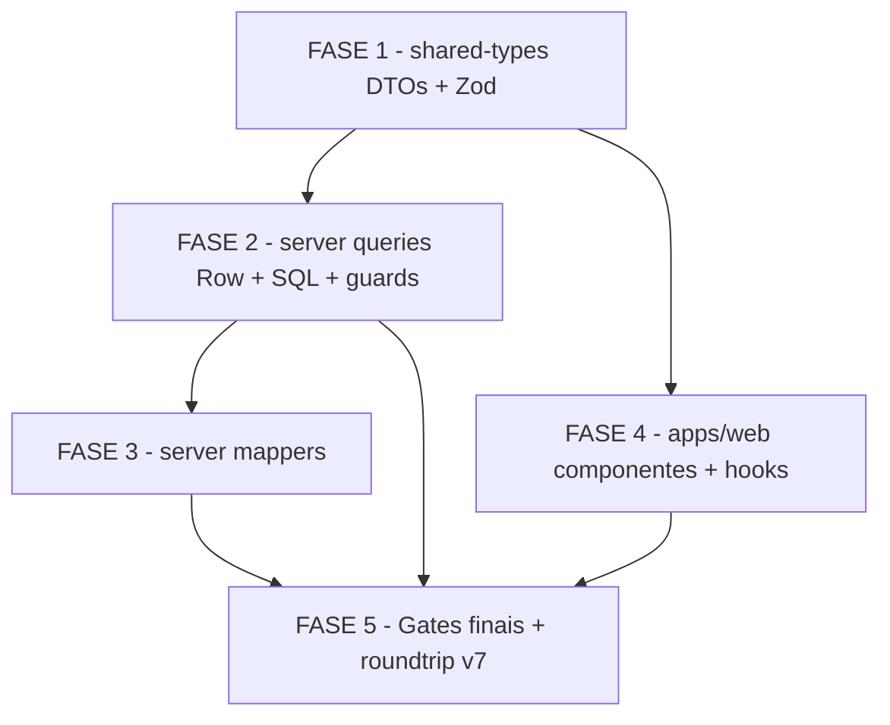

# Tasks — new-schema

> **Feature**: `new-schema` — adaptar cstk-panel ao schema v7 (EN canonical)
> **Spec**: `docs/specs/new-schema/spec.md`
> **Plan**: `docs/specs/new-schema/plan.md`
> **Data model**: `docs/specs/new-schema/data-model.md`
> **Quickstart**: `docs/specs/new-schema/quickstart.md`
> **Gerado**: 2026-05-30
>
> Ordem de execução: camada por camada (dependência estrita bottom-up):
> FASE 1 (shared-types) → FASE 2 (server queries + hasColumn/hasTable) →
> FASE 3 (server mappers) → FASE 4 (apps/web) → FASE 5 (testes e gates finais)

---

## Legendas

| Status | Símbolo |
|--------|---------|
| Pendente | `[ ]` |
| Em andamento | `[~]` |
| Concluído | `[x]` |
| Bloqueado | `[!]` |

| Criticidade | Tag | Critério |
|-------------|-----|---------|
| Crítico | `[C]` | Funcionalidade core sem a qual o painel quebra ou retorna NULL silencioso contra v7 |
| Alto | `[A]` | Qualidade e corretude — sem isso, campos aparecem errados ou tsc falha |
| Médio | `[M]` | Graceful degradation v6, guards de back-compat, limpeza de nomenclatura |

---

## FASE 1 — shared-types: DTOs e Zod schemas

> **Dependência**: nenhuma — ponto de partida da cadeia.
> **Gate de fase**: `pnpm --filter @cstk-panel/shared-types exec tsc --noEmit` = 0 erros.
>
> Renomear os campos das interfaces e schemas Zod de pt-BR para EN camelCase.
> Esta fase intencionalmentetorna as referências downstream (`mappers`, `web`) em
> erros de compilação — o `tsc` vira o worklist para as fases seguintes.
>
> Ref: spec.md FR-004, FR-005; data-model.md §todos os entities; plan.md §Phase ordering

### 1.1 Renomear campos de ExecutionDTO e ExecutionDTOSchema [C]

Ref: spec.md FR-004; data-model.md §Entity: executions

- [x] 1.1.1 Em `packages/shared-types/src/entities.ts`: renomear todos os campos pt-BR de `ExecutionDTO` para EN camelCase conforme data-model.md (`execucaoId→executionId`, `motivoTermino→terminationReason`, `etapaCorrente→currentStage`, `iniciadaEm→startedAt`, `terminadaEm→finishedAt`, `duracaoSegundos→durationSeconds`, `stackSugerida→suggestedStack`, `ondasTotal→wavesTotal`, `wallclockTotalSegundos→wallclockTotalSeconds`, `subagentesSpawned→subagentsSpawned`, `profundidadeMax→maxDepth`, `decisoesTotal→decisionsTotal`, `bloqueiosHumanosTotal→humanBlocksTotal`, `sugestoesSkillsTotal→skillSuggestionsTotal`, `issuesToolkitAbertas→toolkitIssuesOpened`)
- [x] 1.1.2 Em `packages/shared-types/src/schemas/entities.ts`: renomear os mesmos campos em `ExecutionDTOSchema` (z.object) para paridade exata com a interface
- [x] 1.1.3 Atualizar JSDoc/comentários da interface para refletir os novos nomes
- [x] 1.1.4 Verificar paridade exata: `grep -n "execucaoId\|motivoTermino\|etapaCorrente\|iniciadaEm" packages/shared-types/src/entities.ts` deve retornar zero resultados fora de comentários de migração

### 1.2 Renomear campos de WaveDTO e WaveDTOSchema [C]

Ref: spec.md FR-004; data-model.md §Entity: waves

- [x] 1.2.1 Em `entities.ts`: renomear `WaveDTO` — `etapas→stages`, `inicio→startedAt`, `fim→finishedAt`, `motivoTermino→terminationReason`, `nEtapas→nStages`; manter `execucaoId→executionId`
- [x] 1.2.2 Em `schemas/entities.ts`: renomear campos de `WaveDTOSchema` para paridade exata
- [x] 1.2.3 Verificar que `etapas`/`inicio`/`fim`/`nEtapas` não constam mais na interface nem no schema

### 1.3 Renomear campos de DecisionDTO e DecisionDTOSchema [C]

Ref: spec.md FR-004; data-model.md §Entity: decisions

- [x] 1.3.1 Em `entities.ts`: renomear `DecisionDTO` — `execucaoId→executionId`, `etapa→stage`, `agente→agent`, `escolha→choice`, `opcoes→options`, `contexto→context`, `justificativa→rationale` (manter `score`, `evidence` já EN, `wave` inalterado)
- [x] 1.3.2 Em `schemas/entities.ts`: renomear campos de `DecisionDTOSchema` para paridade exata
- [x] 1.3.3 Manter o comentário `@untrusted` nos campos textuais (`context`, `rationale`, `evidence`)

### 1.4 Renomear campos de TaskDTO e TaskDTOSchema [C]

Ref: spec.md FR-004, FR-010; data-model.md §Entity: tasks

- [x] 1.4.1 Em `entities.ts`: renomear `TaskDTO` — `execucaoId→executionId`, `titulo→title`, `testesRodados→testsRun`, `testesPassados→testsPassed`, `arquivosTocadosCount→touchedFilesCount` (manter `lintOk`, `outcome`, `wave` inalterados)
- [x] 1.4.2 Em `schemas/entities.ts`: renomear campos de `TaskDTOSchema` para paridade exata
- [x] 1.4.3 Verificar que `titulo`/`testesRodados`/`testesPassados` não constam mais na interface

### 1.5 Renomear BloqueioDTO→BlockDTO e BloqueioDTOSchema→BlockDTOSchema [C]

Ref: spec.md FR-002, FR-004; data-model.md §Entity: blocks

- [x] 1.5.1 Em `entities.ts`: renomear a interface `BloqueioDTO→BlockDTO` e todos os seus campos — `execucaoId→executionId`, `pergunta→question`, `contextoParaResposta→contextForAnswer`, `resposta→answer`, `decisaoId→decisionId`, `disparadoEm→triggeredAt`, `respondidoEm→answeredAt`, `latenciaSegundos→latencySeconds` (manter `status`)
- [x] 1.5.2 Em `schemas/entities.ts`: renomear `BloqueioDTOSchema→BlockDTOSchema` e todos os seus campos para paridade exata
- [x] 1.5.3 Atualizar `export` em `packages/shared-types/src/index.ts` para exportar `BlockDTO`, `BlockDTOSchema` no lugar de `BloqueioDTO`, `BloqueioDTOSchema`

### 1.6 Renomear campos de EventDTO e EventDTOSchema [C]

Ref: spec.md FR-004; data-model.md §Entity: events

- [x] 1.6.1 Em `entities.ts`: renomear `EventDTO` — `execucaoId→executionId`, `descricao→description` (manter `eventType`, `timestamp` já EN)
- [x] 1.6.2 Em `schemas/entities.ts`: renomear campos de `EventDTOSchema` para paridade exata

### 1.7 Renomear campos de AlertSignalDTO e AlertSignalDTOSchema [C]

Ref: spec.md FR-004; data-model.md §Entity: alert_signals

- [x] 1.7.1 Em `entities.ts`: renomear `AlertSignalDTO` — `execucaoId→executionId`, `tipo→type`, `subtipo→subtype`, `valorConsumido→consumedValue`, `valorThreshold→thresholdValue`, `descricao→description` (manter `wave`)
- [x] 1.7.2 Em `schemas/entities.ts`: renomear campos de `AlertSignalDTOSchema` para paridade exata

### 1.8 Renomear campos de RetroDTO e RetroDTOSchema [A]

Ref: spec.md FR-004; data-model.md §Entity: retros

- [x] 1.8.1 Em `entities.ts`: renomear `RetroDTO` — `execucaoId→executionId`, `texto→text` (manter `wave`)
- [x] 1.8.2 Em `schemas/entities.ts`: renomear campos de `RetroDTOSchema` para paridade exata

### 1.9 Renomear campos de SkillDTO, SuggestionDTO e seus schemas [A]

Ref: spec.md FR-004; data-model.md §Entity: skills, suggestions

- [x] 1.9.1 Em `entities.ts`: renomear `SkillDTO` — `execucaoId→executionId`, `decisaoId→decisionId` (manter `skillName`, `wave`)
- [x] 1.9.2 Em `entities.ts`: renomear `SuggestionDTO` — `execucaoId→executionId`, `skillAfetada→affectedSkill`, `severidade→severity`, `diagnostico→diagnosis`, `proposta→proposal`, `issueAberta→issueOpened`, `criadaEm→createdAt` (manter `sourceId`, `referencias`)
- [x] 1.9.3 Em `schemas/entities.ts`: renomear `SkillDTOSchema` e `SuggestionDTOSchema` para paridade exata com as interfaces renomeadas

### 1.10 Renomear campos em rollups: FeatureRollup e ProjectRollup [A]

Ref: spec.md FR-004; plan.md §Project Structure

- [x] 1.10.1 Em `entities.ts`: renomear `FeatureRollup` — `totalBloqueios→totalBlocks`, `etapaCorrente→currentStage` (demais campos já EN)
- [x] 1.10.2 Verificar paridade com o que o server retorna (renomear FeatureRollupRow em executions.ts na FASE 2)

### 1.11 Gate de fase 1: verificar tsc e paridade DTOs ↔ Zod [C]

Ref: spec.md FR-013; quickstart.md §Scenario A

- [x] 1.11.1 Executar `pnpm --filter @cstk-panel/shared-types exec tsc --noEmit` — deve retornar 0 erros (falhar aqui indica inconsistência interna no shared-types)
- [x] 1.11.2 Verificar paridade: para cada DTO, confirmar que cada campo da interface tem campo idêntico no schema Zod correspondente (grep cruzado ou inspeção manual)
- [x] 1.11.3 Verificar que `packages/shared-types/src/index.ts` exporta os novos nomes (`BlockDTO`, `BlockDTOSchema`) sem referências obsoletas

---

## FASE 2 — server queries: Row interfaces, SQL e guards hasColumn/hasTable

> **Dependência**: FASE 1 concluída (DTO renomeados — mapper/web irão errar em tsc
> apontando exatamente o que falta mudar).
> **Gate de fase**: `pnpm --filter @cstk-panel/server exec tsc --noEmit` = 0 erros
> (junto com FASE 3 que fecha os mappers).
>
> Renomear Row interfaces para EN snake_case, atualizar SQL, adicionar hasColumn para
> cada coluna renomeada, e realizar o rename de tabela bloqueios→blocks.
>
> Ref: spec.md FR-001, FR-002, FR-003, FR-007, FR-008, FR-010, FR-011;
> plan.md §Phase ordering; data-model.md §todos os entities

### 2.1 Atualizar executions.ts: ExecutionRow + SQL + hasColumn guards [C]

Ref: spec.md FR-001, FR-007, FR-011; data-model.md §Entity: executions

- [x] 2.1.1 Em `apps/server/src/db/queries/executions.ts`: renomear todos os campos de `ExecutionRow` de pt-BR para EN snake_case (ex: `execucao_id→execution_id`, `motivo_termino→termination_reason`, `etapa_corrente→current_stage`, `iniciada_em→started_at`, `terminada_em→finished_at`, `duracao_segundos→duration_seconds`, `stack_sugerida→suggested_stack`, `ondas_total→waves_total`, `wallclock_total_segundos→wallclock_total_seconds`, `subagentes_spawned→subagents_spawned`, `profundidade_max→max_depth`, `decisoes_total→decisions_total`, `bloqueios_humanos_total→human_blocks_total`, `sugestoes_skills_total→skill_suggestions_total`, `issues_toolkit_abertas→toolkit_issues_opened`)
- [x] 2.1.2 Atualizar o SELECT em `listExecutions` e `getExecution` para usar os novos nomes de coluna EN
- [x] 2.1.3 Adicionar helpers `hasColumn` para cada coluna renomeada (espelhando padrão existente para `opcoes` em decisions.ts) — colunas ausentes retornam `NULL AS <new_en_name>`
- [x] 2.1.4 Atualizar `getRollupByProject` e `getRollupByFeature` (FR-011): renomear `etapa_corrente`, `iniciada_em`, `ondas_total` nas queries SQL e na interface `FeatureRollupRow`
- [x] 2.1.5 Teste: confirmar que `ExecutionRow` não contém nenhum campo em pt-BR (`grep -n "execucao_id\|motivo_termino\|etapa_corrente\|iniciada_em" apps/server/src/db/queries/executions.ts` deve retornar zero fora de comentários)

### 2.2 Atualizar waves.ts: WaveRow + SQL + hasColumn guards [C]

Ref: spec.md FR-001, FR-007; data-model.md §Entity: waves

- [x] 2.2.1 Em `apps/server/src/db/queries/waves.ts`: renomear campos de `WaveRow` — `execucao_id→execution_id`, `etapas→stages`, `inicio→started_at`, `fim→finished_at`, `motivo_termino→termination_reason`, `n_etapas→n_stages`
- [x] 2.2.2 Atualizar o SELECT em `listWavesByExecution` para usar os novos nomes de coluna EN
- [x] 2.2.3 Adicionar guards `hasColumn` para cada coluna renomeada (v6 back-compat): `stages`, `started_at`, `finished_at`, `termination_reason`, `n_stages`
- [x] 2.2.4 Teste: confirmar que `WaveRow` não contém pt-BR e que a query usa apenas EN

### 2.3 Atualizar decisions.ts: DecisionRow + SQL + hasColumn guards [C]

Ref: spec.md FR-001, FR-003, FR-007; data-model.md §Entity: decisions

- [x] 2.3.1 Em `apps/server/src/db/queries/decisions.ts`: renomear campos de `DecisionRow` — `execucao_id→execution_id`, `etapa→stage`, `agente→agent`, `escolha→choice`, `opcoes→options`, `contexto→context`, `justificativa→rationale` (manter `evidencia→evidence` se já não estiver renomeado)
- [x] 2.3.2 Atualizar todos os SELECTs e filtros em `listDecisions` e `countDecisions` para usar os novos nomes (ex: `WHERE stage = ?`, `ORDER BY stage`)
- [x] 2.3.3 Atualizar a função `opcoesSelect` para referenciar `options` (novo nome) em vez de `opcoes`; renomear a função para `optionsSelect` para manter consistência
- [x] 2.3.4 Adicionar guard `hasColumn` para `evidence` se ausente em bases mais antigas
- [x] 2.3.5 Teste: verificar que `DecisionFilters` e todos os filtros dinâmicos usam EN

### 2.4 Atualizar tasks.ts: TaskRow + SQL + titleSelect helper [C]

Ref: spec.md FR-001, FR-003, FR-007, FR-010; data-model.md §Entity: tasks

- [x] 2.4.1 Em `apps/server/src/db/queries/tasks.ts`: renomear campos de `TaskRow` — `execucao_id→execution_id`, `titulo→title`, `testes_rodados→tests_run`, `testes_passados→tests_passed`, `arquivos_tocados→touched_files`
- [x] 2.4.2 Renomear a função `tituloSelect` para `titleSelect`; atualizar o guard para checar coluna `title` (nova) em vez de `titulo`; a projeção de fallback passa a ser `'' AS title`
- [x] 2.4.3 Atualizar o SELECT em `listTasksByExecution` para usar os novos nomes (inclusive chamar `titleSelect` renomeada)
- [x] 2.4.4 Adicionar guards `hasColumn` para `tests_run`, `tests_passed`, `touched_files`
- [x] 2.4.5 Atualizar todos os imports de `tituloSelect` em outros arquivos (`cross.ts`) para usar `titleSelect`

### 2.5 Renomear bloqueios.ts → atualizar para blocks: BlockRow + tabela blocks [C]

Ref: spec.md FR-002, FR-003, FR-007; data-model.md §Entity: blocks

- [x] 2.5.1 Em `apps/server/src/db/queries/bloqueios.ts`: renomear a interface `BloqueioRow→BlockRow` e todos os campos — `execucao_id→execution_id`, `pergunta→question`, `contexto_para_resposta→context_for_answer`, `resposta→answer`, `decisao_id→decision_id`, `disparado_em→triggered_at`, `respondido_em→answered_at`, `latencia_segundos→latency_seconds`
- [x] 2.5.2 Atualizar a query SQL para usar `FROM blocks` em vez de `FROM bloqueios` e todas as colunas EN
- [x] 2.5.3 Adicionar guard `hasTable(db, 'blocks')` envolvendo a query — se ausente, retornar `[]` (mirror do padrão `suggestions`); a função passa a se chamar `listBlocksByExecution`
- [x] 2.5.4 Adicionar guards `hasColumn` para cada coluna renomeada (back-compat v6 onde a tabela `blocks` existe mas colunas podem ser pt-BR)
- [x] 2.5.5 Teste: confirmar que `BlockRow` e `listBlocksByExecution` não referenciam `bloqueios` ou pt-BR fora de comentários históricos

### 2.6 Atualizar events.ts: EventRow + SQL [C]

Ref: spec.md FR-001, FR-003; data-model.md §Entity: events

- [x] 2.6.1 Em `apps/server/src/db/queries/events.ts`: renomear campos de `EventRow` — `execucao_id→execution_id`, `descricao→description` (manter `event_type`, `timestamp`)
- [x] 2.6.2 Atualizar o SELECT em `listEventsByExecution` para usar `description` em vez de `descricao`
- [x] 2.6.3 Adicionar guard `hasColumn(db, 'events', 'description')` para back-compat com bases onde `descricao` ainda é o nome

### 2.7 Atualizar alerts.ts: AlertRow + SQL [C]

Ref: spec.md FR-001, FR-003; data-model.md §Entity: alert_signals

- [x] 2.7.1 Em `apps/server/src/db/queries/alerts.ts`: renomear campos de `AlertRow` — `execucao_id→execution_id`, `tipo→type`, `subtipo→subtype`, `valor_consumido→consumed_value`, `valor_threshold→threshold_value`, `descricao→description`
- [x] 2.7.2 Atualizar o SELECT em `listAlertsByExecution` para usar os novos nomes EN
- [x] 2.7.3 Adicionar guards `hasColumn` para cada coluna renomeada

### 2.8 Atualizar skills.ts e retros.ts: SkillRow, RetroRow + SQL [A]

Ref: spec.md FR-001, FR-003; data-model.md §Entity: skills, retros

- [x] 2.8.1 Em `apps/server/src/db/queries/skills.ts`: renomear `execucao_id→execution_id`, `decisao_id→decision_id` em `SkillRow` e no SELECT
- [x] 2.8.2 Em `apps/server/src/db/queries/retros.ts`: renomear `RetroRow.texto→text` e o SELECT; a interface inline usa `execucaoId` (já camelCase — verificar se é Row ou DTO direto e corrigir conforme)
- [x] 2.8.3 Adicionar guard `hasColumn` para `text` (era `texto`) em retros

### 2.9 Atualizar suggestions.ts: SuggestionRow + SQL [A]

Ref: spec.md FR-001, FR-003; data-model.md §Entity: suggestions

- [x] 2.9.1 Em `apps/server/src/db/queries/suggestions.ts`: renomear campos de `SuggestionRow` — `execucao_id→execution_id`, `skill_afetada→affected_skill`, `severidade→severity`, `diagnostico→diagnosis`, `proposta→proposal`, `issue_aberta→issue_opened`, `source_ts→created_at` (manter `source_id`, `referencias`)
- [x] 2.9.2 Atualizar o SELECT em `listSuggestionsByExecution` para usar novos nomes EN
- [x] 2.9.3 Adicionar guards `hasColumn` para colunas renomeadas

### 2.10 Atualizar metrics.ts e overview.ts: queries de métricas EN [C]

Ref: spec.md FR-008; data-model.md §Entity: executions, waves, decisions, tasks

- [x] 2.10.1 Em `apps/server/src/db/queries/metrics.ts`: renomear todas as referências pt-BR em queries — `iniciada_em→started_at`, `duracao_segundos→duration_seconds`, `profundidade_max→max_depth`, `subagentes_spawned→subagents_spawned`, `bloqueios_humanos_total→human_blocks_total`, `motivo_termino→termination_reason`, `etapa_corrente→current_stage`, `ondas_total→waves_total`, `wallclock_total_segundos→wallclock_total_seconds`, `decisoes_total→decisions_total`, `etapa→stage` (em decisions), `escolha→choice`, `inicio→started_at` (em waves), `fim→finished_at` (waves), `n_etapas→n_stages`, `etapas→stages`, `titulo→title` (tasks), `testes_rodados→tests_run`, `testes_passados→tests_passed`, `arquivos_tocados→touched_files`, `execucao_id→execution_id` (JOINs)
- [x] 2.10.2 Renomear Row/Result interfaces de métricas para usar EN (ex: `ThroughputByStageRow.etapa→stage`, `CostOverTimeRow.day` via `date(started_at)`)
- [x] 2.10.3 Em `apps/server/src/db/queries/overview.ts`: renomear `etapa_corrente→current_stage`, `iniciada_em→started_at`, `ondas_total→waves_total`, `tool_calls_total` (keep), `tipo→type`, `subtipo→subtype`, `descricao→description`, `valor_consumido→consumed_value`, `valor_threshold→threshold_value`, `etapa→stage`, `execucao_id→execution_id` (JOINs) nos Row types e queries
- [x] 2.10.4 Verificar que `latency` em métricas usa `latency_seconds` (blocks table) e `human_blocks_total` (executions)
- [x] 2.10.5 Teste: executar `grep -n "iniciada_em\|etapa_corrente\|duracao_segundos\|profundidade_max\|execucao_id" apps/server/src/db/queries/metrics.ts apps/server/src/db/queries/overview.ts` — deve retornar zero fora de guards/comentários

### 2.11 Atualizar cross.ts: CrossAlertRow, CrossTaskRow, CrossEventRow + SQL [C]

Ref: spec.md FR-001; plan.md §Project Structure

- [x] 2.11.1 Em `apps/server/src/db/queries/cross.ts`: renomear campos em `CrossAlertRow` (`execucao_id→execution_id`, `tipo→type`, `subtipo→subtype`, `valor_consumido→consumed_value`, `valor_threshold→threshold_value`, `descricao→description`)
- [x] 2.11.2 Renomear campos em `CrossTaskRow` (`execucao_id→execution_id`, `titulo→title`, `testes_rodados→tests_run`, `testes_passados→tests_passed`, `arquivos_tocados→touched_files`)
- [x] 2.11.3 Renomear campos em `CrossEventRow` (`execucao_id→execution_id`, `descricao→description`)
- [x] 2.11.4 Atualizar todos os SELECTs e JOINs em `listCrossAlerts`, `listCrossTasks`, `listCrossEvents` para usar EN (incluindo `e.execution_id` nos JOINs em vez de `e.execucao_id`, e `e.started_at` nos filtros de período em vez de `e.iniciada_em`)
- [x] 2.11.5 Atualizar import de `tituloSelect→titleSelect` e sua chamada com prefixo `t.`
- [x] 2.11.6 Teste: grep por `execucao_id\|iniciada_em\|tipo\b\|descricao` em cross.ts deve retornar zero fora de guards/comentários

### 2.12 Gate de fase 2: verificar tsc do server (parcial) [A]

Ref: spec.md FR-013; quickstart.md §Scenario A

- [x] 2.12.1 Executar `pnpm --filter @cstk-panel/server exec tsc --noEmit` — os erros restantes devem ser apenas em `mappers/` (FASE 3 ainda não executada), não em `db/queries/`
- [x] 2.12.2 Verificar que `db/queries/*.ts` não têm erros isolados de queries (separar erros de mappers dos de queries)

---

## FASE 3 — server mappers: snake_case EN Row → camelCase EN DTO

> **Dependência**: FASE 1 e FASE 2 concluídas.
> **Gate de fase**: `pnpm --filter @cstk-panel/server exec tsc --noEmit` = 0 erros
> (incluindo FASE 2 já aplicada).
>
> Atualizar cada mapper para ler os novos campos EN da Row e escrever os novos campos
> EN do DTO. Nenhum mapper pode referenciar campo pt-BR de uma coluna renomeada.
>
> Ref: spec.md FR-006; plan.md §Mapper layer; data-model.md §Mapper-layer invariant

### 3.1 Atualizar mapper execution.ts [C]

Ref: spec.md FR-006; data-model.md §Entity: executions

- [x] 3.1.1 Em `apps/server/src/mappers/execution.ts`: atualizar `mapExecution` para ler os campos EN de `ExecutionRow` (ex: `row.execution_id`, `row.termination_reason`, `row.current_stage`, `row.started_at`, etc.) e escrever os campos EN de `ExecutionDTO` (`executionId`, `terminationReason`, `currentStage`, `startedAt`, etc.)
- [x] 3.1.2 Verificar que não há referência a nenhum campo pt-BR no mapper após a atualização

### 3.2 Atualizar mapper wave.ts [C]

Ref: spec.md FR-006; data-model.md §Entity: waves

- [x] 3.2.1 Em `apps/server/src/mappers/wave.ts`: atualizar `mapWave` para ler `row.execution_id`, `row.stages`, `row.started_at`, `row.finished_at`, `row.termination_reason`, `row.n_stages` e escrever `executionId`, `stages`, `startedAt`, `finishedAt`, `terminationReason`, `nStages`
- [x] 3.2.2 Manter comentário que `stages` permanece `string` (não array) do schema v2

### 3.3 Atualizar mapper decision.ts [C]

Ref: spec.md FR-006; data-model.md §Entity: decisions

- [x] 3.3.1 Em `apps/server/src/mappers/decision.ts`: atualizar `mapDecision` para ler `row.execution_id`, `row.stage`, `row.agent`, `row.choice`, `row.options`, `row.context`, `row.rationale`, `row.evidence` e escrever os campos EN do `DecisionDTO`
- [x] 3.3.2 Manter comentários `@untrusted` nos campos textuais

### 3.4 Atualizar mapper task.ts [C]

Ref: spec.md FR-006; data-model.md §Entity: tasks

- [x] 3.4.1 Em `apps/server/src/mappers/task.ts`: atualizar `mapTask` para ler `row.execution_id`, `row.title`, `row.tests_run`, `row.tests_passed`, `row.touched_files` e escrever `executionId`, `title`, `testsRun`, `testsPassed`, `touchedFilesCount`
- [x] 3.4.2 Manter a conversão `lint_ok: INTEGER 0/1 → boolean` (campo inalterado)

### 3.5 Renomear bloqueio.ts → block.ts: mapBloqueio→mapBlock [C]

Ref: spec.md FR-002, FR-006; data-model.md §Entity: blocks

- [x] 3.5.1 Criado `apps/server/src/mappers/block.ts` com `mapBlock`/`mapBlocks` usando `BlockRow` e `BlockDTO` (EN)
- [x] 3.5.2 `mapBlock` lê `row.execution_id`, `row.question`, `row.context_for_answer`, `row.answer`, `row.decision_id`, `row.triggered_at`, `row.answered_at`, `row.latency_seconds` e escreve campos EN do `BlockDTO`
- [x] 3.5.3 Atualizado `apps/server/src/mappers/index.ts` para importar de `block.js`; removido `bloqueio.ts` órfão
- [x] 3.5.4 Routes atualizadas para usar novos nomes EN

### 3.6 Atualizar mappers event.ts, alert.ts, skill.ts, suggestion.ts [C]

Ref: spec.md FR-006; data-model.md §todos os entities

- [x] 3.6.1 Em `mappers/event.ts`: atualizar `mapEvent` para ler `row.execution_id`, `row.description` e escrever `executionId`, `description`
- [x] 3.6.2 Em `mappers/alert.ts`: atualizar `mapAlert` para ler `row.execution_id`, `row.type`, `row.subtype`, `row.consumed_value`, `row.threshold_value`, `row.description` e escrever os campos EN de `AlertSignalDTO`
- [x] 3.6.3 Em `mappers/skill.ts`: atualizar `mapSkill` para ler `row.execution_id`, `row.decision_id` e escrever `executionId`, `decisionId`
- [x] 3.6.4 Em `mappers/suggestion.ts`: atualizar `mapSuggestion` para ler os campos EN da `SuggestionRow` e escrever `executionId`, `affectedSkill`, `severity`, `diagnosis`, `proposal`, `issueOpened`, `createdAt`

### 3.7 Atualizar mapper retro (se existir) [A]

Ref: spec.md FR-006; data-model.md §Entity: retros

- [x] 3.7.1 `mappers/retro.ts` verificado — existe e já usa EN (executionId, text); nenhuma alteração necessária
- [x] 3.7.2 Rota features.ts usa `listRetrosByFeature` diretamente sem mapper intermediário — correto

### 3.8 Gate de fase 3: tsc do server completo [C]

Ref: spec.md FR-013; quickstart.md §Scenario A

- [x] 3.8.1 `npx tsc --noEmit -p apps/server/tsconfig.json` retorna 0 erros (FASE 2 + FASE 3 concluídas)
- [x] 3.8.2 Grep confirma: zero referências pt-BR em mappers/ e db/queries/ (fora de comentários históricos)
- [x] 3.8.3 `npx vitest run --root apps/server` retorna 146/146 testes passando (zero regressões)

---

## FASE 4 — apps/web: consumir DTOs EN no frontend

> **Dependência**: FASE 1 concluída (shared-types com DTOs EN exportados).
> **Gate de fase**: `pnpm --filter @cstk-panel/web exec tsc --noEmit` = 0 erros.
>
> Atualizar componentes, hooks e utilitários do frontend que desestruturaram campos
> pt-BR dos DTOs. Após FASE 1, qualquer referência obsoleta já é erro de tsc.
>
> Ref: spec.md FR-009; plan.md §Phase ordering

### 4.1 Atualizar hooks.ts: schemas e tipos EN [C]

Ref: spec.md FR-009; plan.md §Frontend DTO

- [x] 4.1.1 Em `apps/web/src/lib/hooks.ts`: substituir `BloqueioDTOSchema→BlockDTOSchema` no import e na definição de `BloqueioListSchema→BlockListSchema`
- [x] 4.1.2 Renomear `useBloqueios→useBlocks` (ou criar alias `useBlocks = useBloqueios` enquanto a transição está em andamento)
- [x] 4.1.3 Verificar que todos os schemas inline em hooks.ts (`DecisionsPageSchema`, `TasksResultSchema`, etc.) não referenciam campos pt-BR — ajustar se necessário
- [x] 4.1.4 Teste: `pnpm --filter @cstk-panel/web exec tsc --noEmit` pós-atualização deve não ter erros em hooks.ts

### 4.2 Atualizar ExecutionDetail.tsx: campos de WaveDTO e DecisionDTO [C]

Ref: spec.md FR-009; plan.md §Frontend DTO

- [x] 4.2.1 Em `apps/web/src/screens/ExecutionDetail.tsx`: substituir `w.etapas→w.stages`, `w.motivoTermino→w.terminationReason`, `w.inicio→w.startedAt`, `w.fim→w.finishedAt`, `w.nEtapas→w.nStages` nas referências a `WaveDTO`
- [x] 4.2.2 Substituir `d.etapa→d.stage`, `d.agente→d.agent`, `d.escolha→d.choice`, `d.opcoes→d.options`, `d.contexto→d.context`, `d.justificativa→d.rationale` nas referências a `DecisionDTO`
- [x] 4.2.3 Substituir `t.titulo→t.title`, `t.testesRodados→t.testsRun`, `t.testesPassados→t.testsPassed`, `t.arquivosTocadosCount→t.touchedFilesCount` nas referências a `TaskDTO`
- [x] 4.2.4 Substituir `e.descricao→e.description` nas referências a `EventDTO`
- [x] 4.2.5 Substituir `a.tipo→a.type`, `a.subtipo→a.subtype`, `a.valorConsumido→a.consumedValue`, `a.valorThreshold→a.thresholdValue`, `a.descricao→a.description` nas referências a `AlertSignalDTO`
- [x] 4.2.6 Substituir `b.pergunta→b.question`, `b.contextoParaResposta→b.contextForAnswer`, `b.resposta→b.answer`, `b.decisaoId→b.decisionId`, `b.latenciaSegundos→b.latencySeconds` nas referências a `BlockDTO` (era `BloqueioDTO`)
- [x] 4.2.7 Substituir `s.skillAfetada→s.affectedSkill`, `s.severidade→s.severity`, `s.diagnostico→s.diagnosis`, `s.proposta→s.proposal`, `s.issueAberta→s.issueOpened`, `s.criadaEm→s.createdAt` nas referências a `SuggestionDTO`
- [x] 4.2.8 Atualizar parâmetro de rota `:execucaoId` → considerar se a URL deve mudar ou apenas o uso interno; manter URL para não quebrar deep links (apenas variável interna pode ser renomeada)

### 4.3 Atualizar Executions.tsx: campos de ExecutionDTO [C]

Ref: spec.md FR-009

- [x] 4.3.1 Em `apps/web/src/screens/Executions.tsx`: substituir `e.execucaoId→e.executionId`, `e.etapaCorrente→e.currentStage`, `e.ondasTotal→e.wavesTotal`, `e.wallclockTotalSegundos→e.wallclockTotalSeconds`, `e.decisoesTotal→e.decisionsTotal`, `e.iniciadaEm→e.startedAt`, `e.motivoTermino→e.terminationReason`
- [x] 4.3.2 Atualizar a navegação `navigate('/executions/${e.execucaoId}')` → `navigate('/executions/${e.executionId}')`

### 4.4 Atualizar Overview.tsx: campos mistos [C]

Ref: spec.md FR-009

- [x] 4.4.1 Em `apps/web/src/screens/Overview.tsx`: substituir `a.valorConsumido→a.consumedValue`, `a.valorThreshold→a.thresholdValue`, `a.tipo→a.type`, `a.subtipo→a.subtype`, `a.descricao→a.description`, `a.execucaoId→a.executionId`
- [x] 4.4.2 Substituir `f.execucaoId→f.executionId`, `f.etapaCorrente→f.currentStage`, `f.ondasTotal→f.wavesTotal`, `f.iniciadaEm→f.startedAt`
- [x] 4.4.3 Verificar e corrigir o type cast `as string | null` se o campo passou de `etapa` para `stage` em `row.etapa` (métricas passthrough)

### 4.5 Atualizar Metrics.tsx: campos de métricas EN [C]

Ref: spec.md FR-009, FR-008

- [x] 4.5.1 Em `apps/web/src/screens/Metrics.tsx`: substituir `'latenciaSegundos'→'latencySeconds'` nos acessos por string (passthrough JSON)
- [x] 4.5.2 Substituir `'duracaoSegundos'→'durationSeconds'`, `'profundidadeMax'→'maxDepth'`, `'subagentesSpawned'→'subagentsSpawned'`, `'etapa'→'stage'` nos acessos por string a dados de métricas
- [x] 4.5.3 Verificar `r.etapa`/`r.stage` (linha 322): corrigir para usar apenas `r.stage` após rename

### 4.6 Atualizar Tasks.tsx, Alerts.tsx e Incidents.tsx [A]

Ref: spec.md FR-009

- [x] 4.6.1 Em `apps/web/src/screens/Tasks.tsx`: substituir campos da interface local inline (linha 26-29) `testesRodados→testsRun`, `testesPassados→testsPassed`, `arquivosTocadosCount→touchedFilesCount` e todos os usos no componente; substituir `t.titulo→t.title`, `t.execucaoId→t.executionId`
- [x] 4.6.2 Em `apps/web/src/screens/Alerts.tsx`: substituir `a.tipo→a.type`, `a.subtipo→a.subtype`, `a.valorConsumido→a.consumedValue`, `a.valorThreshold→a.thresholdValue`, `a.descricao→a.description`, `a.execucaoId→a.executionId`
- [x] 4.6.3 Em `apps/web/src/screens/Incidents.tsx`: substituir `e.execucaoId→e.executionId`, `e.descricao→e.description` na interface local e nos usos

### 4.7 Atualizar DecisionMapScreen.tsx e componentes de decisão [A]

Ref: spec.md FR-009

- [x] 4.7.1 Em `apps/web/src/screens/DecisionMapScreen.tsx`: substituir `exec.execucaoId→exec.executionId`, `exec.decisoesTotal→exec.decisionsTotal`
- [x] 4.7.2 Verificar `apps/web/src/components/DecisionMapPanel.tsx` e `DecisionDetailPane.tsx` por campos pt-BR (`escolha`, `etapa`, `agente`, `opcoes`, `contexto`, `justificativa`, `evidencia`)
- [x] 4.7.3 Atualizar todos os campos encontrados para EN camelCase

### 4.8 Atualizar DecisionDetailPane e outros componentes [A]

Ref: spec.md FR-009

- [x] 4.8.1 Em `apps/web/src/components/DecisionDetailPane.tsx`: substituir `d.escolha→d.choice`, `d.etapa→d.stage`, `d.agente→d.agent`, `d.opcoes→d.options`, `d.contexto→d.context`, `d.justificativa→d.rationale`, `d.evidencia→d.evidence`
- [x] 4.8.2 Verificar outros componentes que consomem DTOs: `PipelineProgress.tsx`, `FeaturesTable.tsx`, `BudgetMini.tsx` — atualizar `etapaCorrente→currentStage` se presente
- [x] 4.8.3 Verificar utilitários `apps/web/src/lib/*.ts` por referências a campos pt-BR (`overview-select.ts`, `format.ts`, `hooks-schemas.test.ts`)

### 4.9 Paridade de tipos: verificar schemas Zod locais no web [M]

Ref: spec.md FR-005, FR-009; plan.md §Validação Zod; create-tasks skill §Paridade de tipos compartilhados

- [x] 4.9.1 Verificar se `apps/web` define algum schema Zod local duplicando entidades de `shared-types` (grep por `z.object` em `apps/web/src`)
- [x] 4.9.2 Se existirem schemas locais que espelham `ExecutionDTO`, `WaveDTO`, etc.: verificar paridade exata de campos com `packages/shared-types/src/schemas/entities.ts`
- [x] 4.9.3 Atualizar qualquer divergência encontrada (campo com nome pt-BR em schema local vs EN em shared-types)
- [x] 4.9.4 Teste smoke: confirmar que os schemas em `hooks-schemas.test.ts` continuam passando após os renames

### 4.10 Gate de fase 4: tsc do web completo [C]

Ref: spec.md FR-013; quickstart.md §Scenario A

- [x] 4.10.1 Executar `pnpm --filter @cstk-panel/web exec tsc --noEmit` — deve retornar 0 erros
- [x] 4.10.2 Grep de vocabulário no web: `grep -rn "execucaoId\|motivoTermino\|etapaCorrente\|iniciadaEm\|etapas\b\|escolha\b\|justificativa\b\|pergunta\b\|testesRodados\|latenciaSegundos\|profundidadeMax" apps/web/src` deve retornar zero fora de comentários/testes históricos

---

## FASE 5 — Gates finais, testes de regressão e roundtrip v7

> **Dependência**: FASEs 1–4 concluídas.
> **Gate final**: `tsc --noEmit` monorepo completo = 0 + `pnpm -r test` sem regressão +
> roundtrip v7 real (quickstart Cenário B).
>
> Ref: spec.md FR-013, FR-014, Success Criteria 1–6; quickstart.md §todos os Cenários

### 5.1 Gate tsc monorepo completo [C]

Ref: spec.md FR-013; quickstart.md §Scenario A

- [x] 5.1.1 Executar `pnpm -r exec tsc --noEmit` (ou `pnpm --filter @cstk-panel/shared-types exec tsc --noEmit && pnpm --filter @cstk-panel/server exec tsc --noEmit && pnpm --filter @cstk-panel/web exec tsc --noEmit`)
- [x] 5.1.2 Confirmar: zero erros em todos os workspaces
- [x] 5.1.3 Se houver erros residuais, rastrear até a FASE responsável e corrigir antes de prosseguir

### 5.2 Regressão vitest: suites existentes [C]

Ref: spec.md FR-014; quickstart.md §Scenario F

- [x] 5.2.1 Executar `pnpm -r test` (suites existentes: `parity.test.ts`, `parity-real.test.ts`, `envelope.test.ts`, `hooks-schemas.test.ts`, `PipelineProgress.test.ts`, `DecisionMapPanel.test.ts`, `decision-map-layout.test.ts`, `decision-options.test.ts`, `overview-select.test.ts`, `stack-display.test.ts`, `memory-display.test.ts`, `features-filter.ts`, `Sidebar.test.ts`)
- [x] 5.2.2 Confirmar: todas as suites que passavam antes continuam passando
- [x] 5.2.3 Investigar e corrigir qualquer regressão causada pelo rename (ex: testes que acessavam `execucaoId` diretamente em fixtures)

### 5.3 Roundtrip v7 real: Cenário B (quickstart) [C]

Ref: spec.md Success Criterion 1; quickstart.md §Scenario B

- [x] 5.3.1 Confirmar que o DB instalado é v7: `sqlite3 ~/.claude/cstk/knowledge.db "SELECT value FROM schema_meta WHERE key='schema_version';"` deve retornar `7`
- [x] 5.3.2 Iniciar o servidor: `CSTK_KNOWLEDGE_DB="$HOME/.claude/cstk/knowledge.db" pnpm --filter @cstk-panel/server dev`
- [x] 5.3.3 Chamar endpoint executions e capturar payload: `curl -s http://localhost:<port>/api/v1/executions | tee /tmp/exec.json | jq '.data[0]'`
- [x] 5.3.4 Verificar presença de campos EN no payload: `executionId`, `currentStage`, `terminationReason`, `startedAt`, `finishedAt`, `wavesTotal`, `decisionsTotal` — todos não-nulos para a execução de `new-schema`
- [x] 5.3.5 Verificar ausência de campos pt-BR: `! grep -E '"execucaoId"|"etapaCorrente"|"motivoTermino"|"iniciadaEm"' /tmp/exec.json` deve retornar exit 0 (nada encontrado)
- [x] 5.3.6 Drill waves: `curl -s "http://localhost:<port>/api/v1/executions/<execution_id>/waves" | jq '.data'` — verificar que cada wave tem `startedAt`, `finishedAt`, `stages`, `terminationReason`, `nStages`, `nSkills` (não-nulos nas ondas fechadas)
- [x] 5.3.7 Drill decisions (paginado): `curl -s "http://localhost:<port>/api/v1/executions/<execution_id>/decisions?limit=5&offset=0" | jq '.data | length, .[0]'` — verificar campos `agent`, `stage`, `choice`, `context`, `rationale`, `evidence`

### 5.4 Cenário C: blocks table rename + hasTable guard [C]

Ref: spec.md FR-002, FR-007; quickstart.md §Scenario C

- [x] 5.4.1 Chamar endpoint blocks contra v7: `curl -s "http://localhost:<port>/api/v1/executions/<id>/blocks" -o /tmp/b.json -w '%{http_code}\n'` — esperado: HTTP 200, body `data: []`
- [x] 5.4.2 Simular v6 (sem tabela `blocks`): criar fixture copy do DB sem a tabela, apontar servidor e re-chamar — esperado: HTTP 200, `data: []` (hasTable guard funcionando)

### 5.5 Cenário D: degradação graceful v6 para colunas renomeadas [M]

Ref: spec.md FR-007, P2; quickstart.md §Scenario D

- [x] 5.5.1 Criar fixture de DB v6 onde `executions` tem `motivo_termino` mas não `termination_reason`
- [x] 5.5.2 Apontar servidor para o fixture e chamar `GET /api/v1/executions`
- [x] 5.5.3 Verificar: HTTP 200, `terminationReason: null` no payload (hasColumn projetando NULL), sem `5xx`

### 5.6 Cenário E: grep gate de vocabulário único [C]

Ref: spec.md Success Criterion 5; quickstart.md §Scenario E

- [x] 5.6.1 Executar o grep de vocabulário: `grep -rnE 'execucao_id|motivo_termino|etapa_corrente|iniciada_em|\betapas\b|\bescolha\b|justificativa|\bpergunta\b|testes_rodados' apps/server/src packages/shared-types/src | grep -vE 'hasColumn|hasTable|//|/\*|\.test\.|__tests__'`
- [x] 5.6.2 Confirmar: zero resultados fora de guards, comentários e fixtures de teste

### 5.7 Testes adicionais de back-compat v6 (opcional/aditivo) [M]

Ref: spec.md FR-014; quickstart.md §Scenario F

- [x] 5.7.1 Adicionar teste em `packages/shared-types/src/__tests__/parity-real.test.ts` ou arquivo novo para verificar que `BlockDTOSchema.parse(...)` funciona com os campos EN
- [x] 5.7.2 Adicionar teste de fixture v6 para `listBlocksByExecution` com DB sem tabela `blocks` — verificar retorno `[]` sem exceção
- [x] 5.7.3 Verificar que `parity.test.ts` cobre os campos renomeados (atualizar se necessário)

---

## Matriz de Dependências

> Nota: FASE 4 depende apenas de FASE 1 (shared-types) pois o web consome DTOs
> diretamente via shared-types. FASE 2 e FASE 3 (server) são independentes de FASE 4,
> mas todas convergem em FASE 5 (gate monorepo + roundtrip).

---

## Resumo Quantitativo

| Fase | Tarefas | Subtarefas | Criticidade dominante |
|------|---------|------------|----------------------|
| FASE 1 — shared-types | 11 | 32 | [C] |
| FASE 2 — server queries | 12 | 48 | [C] |
| FASE 3 — server mappers | 8 | 28 | [C] |
| FASE 4 — apps/web | 10 | 38 | [C]/[A] |
| FASE 5 — gates finais | 7 | 23 | [C] |
| **Total** | **48** | **169** | — |

---

## Escopo Coberto

- Renomeação de todos os campos pt-BR para EN camelCase nos DTOs de `shared-types` (FR-004)
- Renomeação dos schemas Zod para paridade exata com DTOs (FR-005)
- Renomeação das Row interfaces e SQLs em todos os 14 query files (FR-001/003)
- Rename de tabela `bloqueios→blocks` com guard `hasTable` (FR-002)
- Guards `hasColumn` para todas as colunas renomeadas em cada tabela (FR-007)
- Renomeação da função helper `tituloSelect→titleSelect` (FR-010)
- Rollups `getRollupByProject`/`getRollupByFeature` em EN (FR-011)
- Queries de métricas e overview em EN (FR-008)
- Queries cross-execução em EN (FR-001)
- Atualização de todos os mappers para ler Row EN e escrever DTO EN (FR-006)
- Atualização de todos os componentes, hooks e utilitários do `apps/web` (FR-009)
- Gate `tsc --noEmit` monorepo = 0 erros (FR-013)
- Regressão vitest sem redução de pass rate (FR-014)
- Roundtrip v7 real (quickstart Cenário B) — Success Criterion 1
- Grep gate de vocabulário único — Success Criterion 5

## Escopo Excluído

- Mudanças no arquivo `apps/server/src/db/columns.ts` (já tem `hasColumn`/`hasTable` — apenas reutilizado, não modificado)
- Camada FTS (`knowledge_fts`, `lib/fts.ts`) — FR-012 confirma que não há renomeação nessa camada
- Rotas (`apps/server/src/routes/*.ts`) — renomeiam apenas se importarem nomes obsoletos que o tsc sinalizará; não são target direto das fases acima (corrigidos como efeito colateral)
- Mudanças na lógica de negócio do frontend (componentes de UI) — apenas field names são atualizados
- Atualização de schema do banco de dados (cstk é dono; cstk-panel é consumidor read-only)
- Criação de novas features ou colunas não presentes na migration-map §3.11
- URL paths da API (nenhuma rota muda de nome, apenas os DTOs retornados)
