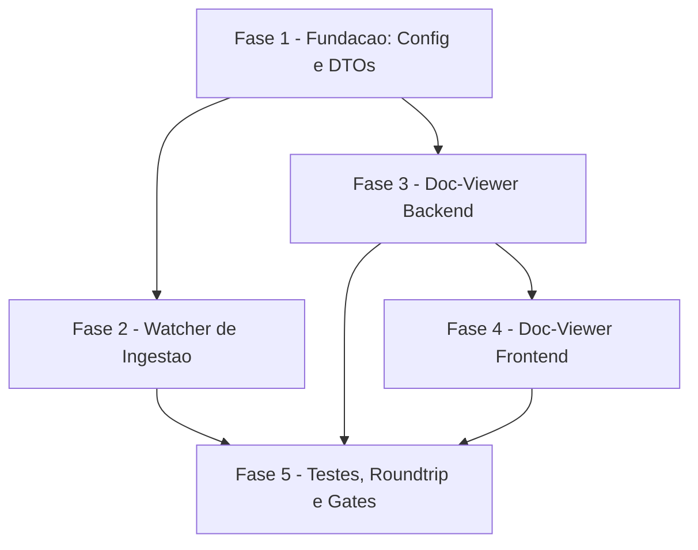

# Tarefas: state-watchers-and-docs

Escopo: Backlog técnico para (US1) watchers de execução `agente-00c`/`feature-00c`
em andamento com atualização quase em tempo real (≤30s) via delegação à ingestão
canônica (`cstk recall --ingest`), e (US2) visualização, dentro do painel
read-only `cstk-panel`, dos artefatos de documentação já produzidos por uma
feature (spec, plano, tarefas, pesquisas, checklists), renderizados de forma
segura (conteúdo UNTRUSTED). Decompõe `spec.md` + `plan.md`
(`docs/specs/state-watchers-and-docs/`).

Ref: [spec.md](spec.md) | [plan.md](plan.md) | [research.md](research.md) |
[data-model.md](data-model.md) | [quickstart.md](quickstart.md) |
[contracts/docs-api.md](contracts/docs-api.md) |
[contracts/watchers.md](contracts/watchers.md) |
[checklists/requirements.md](checklists/requirements.md) |
[checklists/security.md](checklists/security.md) |
[checklists/performance.md](checklists/performance.md)

**Legenda de status:**
- `[ ]` Pendente
- `[~]` Em andamento
- `[x]` Concluído
- `[!]` Bloqueado

**Legenda de criticidade:**
- `[C]` Crítico - Impacto financeiro direto ou bloqueante (aqui: hardening de
  segurança correspondente a findings `HIGH` do gate `owasp-security`, já
  corrigidos no plano — Decisions 6/7 — e o teste obrigatório anti-drift)
- `[A]` Alto - Funcionalidade essencial (núcleo de US1/US2)
- `[M]` Médio - Necessário mas sem urgência imediata (observabilidade opcional,
  bookkeeping de rastreabilidade, gates finais)

---

## FASE 1 - Fundação: Configuração e Contratos Compartilhados

### 1.1 Config: resolução `project` → caminho absoluto `[A]`

Ref: research.md Decision 1 (FR-008); `apps/server/src/config.ts`
(`resolveDbPath()` é o padrão real a espelhar: env > default,
`path.resolve()` anti-traversal)

- [ ] 1.1.1 Implementar `resolveProjectPath(project): string | null` em
      `apps/server/src/config.ts`, espelhando `resolveDbPath()` (env
      `CSTK_PROJECT_PATHS` > default mapa vazio), canonicalizando cada
      entrada com `path.resolve()`
- [ ] 1.1.2 Definir o formato de serialização do env `CSTK_PROJECT_PATHS`
      (ex.: `nome=/abs/path;outro=/x/y`) e o parser correspondente
      **[PROPOSTA — a validar na implementação]** (research Decision 1)
- [ ] 1.1.3 Retornar `null` (nunca lançar erro) quando o projeto não está no
      mapa, para acionar a degradação de FR-012 downstream (2.4, 3.2)
- [ ] 1.1.4 Escrever teste unitário de `resolveProjectPath` (mapa vazio,
      projeto ausente, múltiplas entradas, canonicalização anti-traversal)

### 1.2 DTOs compartilhados dual-def para o doc-viewer `[A]`

Ref: data-model.md Entity "Documentation Artifact"; contracts/docs-api.md;
`packages/shared-types/src/entities.ts` + `schemas/entities.ts` (padrão
dual-def obrigatório — memória `cstk-panel-dto-dual-definition`)

- [ ] 1.2.1 Criar as interfaces `FeatureDocDTO`/`FeatureDocsListDTO` em
      `packages/shared-types/src/entities.ts` (campos `camelCase`: `stage`,
      `artifactId`, `fileName`, `produced`, `extra`, `content`)
- [ ] 1.2.2 Criar o schema Zod correspondente em
      `packages/shared-types/src/schemas/entities.ts`, espelhando
      EXATAMENTE os mesmos campos das interfaces de 1.2.1
- [ ] 1.2.3 Adicionar os novos valores de `reason` do envelope de degradação
      (ex.: `project-path-unresolved`, `project-path-inaccessible`,
      `watcher-ingestion-failed`) ao tipo existente em
      `packages/shared-types/src/envelope.ts` (docs-api.md "Response 200
      degradado"; contracts/watchers.md §3; CHK056/dec-027 — ver 2.4)
- [ ] 1.2.4 Escrever/estender teste de paridade
      (`packages/shared-types/src/__tests__/parity*.test.ts`) cobrindo os
      DTOs novos de 1.2.1/1.2.2

### 1.3 Rastreabilidade dos gaps abertos do checklist `[M]`

Ref: checklists/requirements.md CHK020; checklists/security.md CHK043;
checklists/performance.md CHK045, CHK056, CHK057; dec-027, dec-028
(onda-005)

- [ ] 1.3.1 Registrar nesta decomposição a exclusão de escopo do indicador
      de frescor de CONTEÚDO do artefato — CHK020, resolvido via dec-028:
      **fora do MVP** (ver "Escopo Excluído" abaixo); FR-011 cobre apenas
      frescor de execução, não de artefato de documentação
- [ ] 1.3.2 Confirmar que a postura de segurança medium/low do gate
      `owasp-security` (CHK043, já ratificada em `block-001`/dec-021) está
      referenciada nas tarefas de hardening (Ref cruzada: 2.3)
- [ ] 1.3.3 Confirmar que a medição de duração de ingestão (CHK045) e a
      validação dos defaults de tuning (CHK057) estão encaminhadas como
      subtarefas de validação empírica em FASE 2 (Ref cruzada: 2.3.4)

---

## FASE 2 - Watcher de Ingestão em Segundo Plano (US1, P1)

### 2.1 Módulo de watcher — verificação recorrente e delegação ao subprocesso `cstk` `[A]`

Ref: research.md Decision 2 (FR-001, FR-004, FR-013); contracts/watchers.md
§1-2; data-model.md Entity "Observed Execution"

- [ ] 2.1.1 Criar `apps/server/src/watchers/ingest-watcher.ts` com timer
      (`setInterval`) de cadência configurável (default
      `WATCH_INTERVAL_MS=10_000` **[PROPOSTA]**, Ref CHK057/2.3.4)
- [ ] 2.1.2 Listar execuções com status `em_andamento`/`aguardando_humano`
      reusando o padrão read-only de `db/queries/executions.ts`, abrindo/
      fechando o DB por tick via `openDb()` — sem conexão longa (Princípio
      VI)
- [ ] 2.1.3 Derivar o caminho do projeto (`resolveProjectPath`, 1.1) e o
      state-dir da execução (research Decision 3: layout `feature-00c` vs
      `agente-00c` pela presença/ausência de `feature`)
- [ ] 2.1.4 Delegar a ingestão via `node:child_process.execFile('cstk',
      ['recall','--ingest','--state-dir', dir], { timeout, ... })` — args
      em array (sem shell-string), `timeout` explícito, captura de
      `stderr`/`stdout` (Padrões de Segurança "Subprocesso seguro")
- [ ] 2.1.5 Ociosidade (FR-013): não disparar nenhum subprocesso quando a
      consulta não retorna execução ativa no tick
- [ ] 2.1.6 Escrever testes unitários do módulo watcher (mock de
      `execFile`): tick com execução ativa dispara subprocesso; tick sem
      execução ativa não dispara (quickstart Cenário 2)

### 2.2 Idempotência do disparo de ingestão `[A]`

Ref: research.md Decision 4 (FR-014); data-model.md Entity "Watcher
Signature Cache"

- [ ] 2.2.1 Implementar cache em memória (não persistido — Princípio I)
      keyed por state-dir, com campos `{ signature, lastIngestAt, lastError,
      lastErrorAt }` (`lastError`/`lastErrorAt` adicionados nesta
      decomposição para suportar 2.4 / CHK056)
- [ ] 2.2.2 Calcular a assinatura do `state.json` a cada tick (mtime via
      `fs.statSync`, ou sha256 — decisão final na implementação, research
      Decision 4 **[PROPOSTA]**)
- [ ] 2.2.3 Disparar `cstk recall --ingest` somente quando a assinatura
      mudou desde a última vista para aquele state-dir; caso contrário,
      pular o tick
- [ ] 2.2.4 Escrever teste unitário de idempotência: duas assinaturas
      iguais consecutivas disparam ingestão apenas uma vez

### 2.3 Hardening de segurança do subprocesso e do state-dir derivado `[A]`

Ref: research.md Decision 9 (gate `owasp-security`, findings medium);
checklists/security.md CHK043 (já ratificado dec-021/block-001);
checklists/performance.md CHK045, CHK057

- [ ] 2.3.1 Resolver o binário `cstk` para caminho absoluto verificado (ou
      pinado via config) antes do `execFile`, evitando PATH hijack
      (ASI04/A08); passar `env`/`cwd` mínimos ao subprocesso
- [ ] 2.3.2 Aplicar a MESMA canonicalização + confinamento + regex
      anti-traversal (`/^[^/\\.<>]+$/`) em `feature`/`session` (valores
      UNTRUSTED vindos da knowledge.db, Princípio V) antes de montar o
      state-dir (research Decision 9, item 2)
- [ ] 2.3.3 Limitar subprocessos `cstk` concorrentes por tick (N execuções
      ativas ⇒ N spawns, com teto) e aplicar backoff quando uma ingestão
      falha persistentemente para o mesmo state-dir (research Decision 9,
      item 3)
- [ ] 2.3.4 Medir empiricamente a duração real de `cstk recall --ingest`
      contra um `state.json` típico deste projeto (CHK045) e
      confirmar/ajustar `WATCH_INTERVAL_MS` (CHK057) e o timeout do
      subprocesso contra o orçamento de 30s (research Decision 5); registrar
      o resultado como nota no PR/Decisão de execução (nenhum número de
      duração é afirmado nesta spec como medido)
- [ ] 2.3.5 Escrever testes dos controles de hardening (binário não
      resolvido ⇒ falha segura sem crash; concorrência acima do cap ⇒
      enfileira/rejeita; backoff aplicado após falha persistente)

### 2.4 Sinalização de degradação do watcher no detalhe de execução (CHK056) `[M]`

Ref: contracts/watchers.md §3 ("Decisão de escopo a fechar em
`/create-tasks`"); checklists/performance.md CHK056; dec-027 (resolução:
estender `meta.degraded`/`meta.reason` já existentes, sem endpoint novo
`GET /api/v1/watchers`)

- [ ] 2.4.1 Em `GET /executions/:executionId`
      (`apps/server/src/routes/executions.ts`), consultar o cache de
      assinatura (2.2.1) pelo state-dir derivado da execução; se
      `lastError` presente e mais recente que o último `lastIngestAt`
      bem-sucedido, retornar `meta.degraded:true` /
      `meta.reason:'watcher-ingestion-failed'`
- [ ] 2.4.2 Deixar `GET /executions` (listagem) sem alteração nesta
      feature — o sinal por-execução fica restrito ao endpoint de detalhe
      (decisão de granularidade desta decomposição, Ref dec-027); a lista
      continua refletindo frescor via `FreshnessLabel` já existente
- [ ] 2.4.3 Escrever teste de integração: execução com falha registrada no
      cache retorna `meta.degraded`/`reason` no detalhe; a listagem
      permanece inalterada

### 2.5 Inicialização do watcher no processo do servidor `[A]`

Ref: research.md Decision 2; `apps/server/src/index.ts` (`main()`)

- [ ] 2.5.1 Iniciar o watcher em `main()` após o registro das rotas, com
      cadência configurável via env (2.1.1)
- [ ] 2.5.2 Garantir encerramento limpo do timer no shutdown do processo
      (evitar handle pendente / processo que não finaliza)
- [ ] 2.5.3 Escrever teste smoke de start/stop do watcher

---

## FASE 3 - Doc-Viewer: Backend de Leitura de Artefatos (US2, P2)

### 3.1 Mapeamento fixo etapa-SDD → artefato(s) `[A]`

Ref: research.md Decision 8 (FR-005, FR-007)

- [ ] 3.1.1 Definir a tabela fixa etapa→artefato(s) num módulo compartilhado
      do server (`specify`→`spec.md`; `plan`→`plan.md`,`research.md`,
      `data-model.md`,`quickstart.md`,`contracts/`; `checklist`→
      `checklists/*.md`; `create-tasks`→`tasks.md`)
- [ ] 3.1.2 Implementar função que cruza o mapa fixo com os arquivos reais
      presentes no filesystem da feature, marcando `produced=true/false` e
      `extra=true` para arquivos presentes fora do mapa (SC-002)
- [ ] 3.1.3 Escrever teste unitário do mapeamento (feature completa,
      feature parcial, feature com arquivos extra fora do mapa)

### 3.2 `GET /features/:project/:feature/docs` — listagem de artefatos `[A]`

Ref: contracts/docs-api.md ("listar artefatos");
`apps/server/src/routes/features.ts` (`FeatureParamSchema` a reusar)

- [ ] 3.2.1 Criar `apps/server/src/routes/docs.ts` com a rota, reusando o
      mesmo formato de `FeatureParamSchema` (`project`/`feature`, regex
      anti-traversal `/^[^/\\.<>]+$/`) já usado em `routes/features.ts`
- [ ] 3.2.2 Resolver o caminho do projeto (`resolveProjectPath`, 1.1);
      projeto ausente do mapa ou caminho inacessível ⇒ `wrapDegraded`
      (FR-012), nunca 5xx
- [ ] 3.2.3 Montar a resposta combinando o mapeamento fixo (3.1) com
      metadados (sem `content`), envelope `wrap()` + ETag/304 (padrão de
      `routes/executions.ts`)
- [ ] 3.2.4 Registrar `docsRoutes` em `apps/server/src/index.ts`
      (`v1.register(docsRoutes)` dentro do bloco `/api/v1`, junto às
      demais rotas)
- [ ] 3.2.5 Escrever teste de integração: feature completa, feature
      parcial (`produced:false`), projeto sem entrada no mapa (degradado) —
      quickstart Cenários 5, 7

### 3.3 `GET /features/:project/:feature/docs/:artifact` — conteúdo de um artefato `[A]`

Ref: contracts/docs-api.md ("conteúdo de um artefato"); data-model.md
Entity "Documentation Artifact"

- [ ] 3.3.1 Implementar a rota de conteúdo em `docs.ts`, validando
      `:artifact` contra o mapa fixo (3.1) OU nome de arquivo extra
      sanitizado
- [ ] 3.3.2 Ler o conteúdo markdown bruto do arquivo (cap de tamanho na
      leitura, research Decision 7) e retornar `content:null` +
      `produced:false` quando o artefato do mapa não existe — nunca
      404-erro (FR-007)
- [ ] 3.3.3 Escrever teste de integração: artefato existente retorna
      `content`; artefato do mapa ausente retorna `produced:false`;
      artefato extra fora do mapa é servido (quickstart Cenários 4, 5, 6)

### 3.4 Confinamento anti-traversal e anti-symlink na leitura de artefatos `[C]`

Ref: research.md Decision 7 (FR-009, gate `owasp-security` finding `HIGH`)

- [ ] 3.4.1 Implementar função de guarda `isWithin(root, candidate)` com
      `path.resolve` + `fs.realpath` do arquivo final, re-confinando sob
      `realpath(root)+path.sep` (comparação de prefixo na fronteira do
      separador, não `startsWith` ingênuo)
- [ ] 3.4.2 Rejeitar (via `lstat`) entrada symlinkada apontando para fora
      da raiz permitida (`<projectPath>/docs/specs/<feature>/`)
- [ ] 3.4.3 Aplicar a mesma validação regex anti-traversal nos path params
      `:project`/`:feature`/`:artifact` (reuso de `FeatureParamSchema` +
      schema equivalente para `:artifact`)
- [ ] 3.4.4 Escrever teste de segurança: tentativas de path traversal
      (`../../etc/passwd`, variações `%2f`) e symlink escapando a raiz
      retornam `400`/rejeição, nunca conteúdo fora da fronteira (quickstart
      Cenário 9)

---

## FASE 4 - Doc-Viewer: Frontend de Renderização Segura (US2, P2)

### 4.1 `MarkdownView.tsx` — renderização segura de markdown `[C]`

Ref: research.md Decision 6 (FR-006, FR-010, Princípio V, gate
`owasp-security` finding `HIGH`); `apps/web/src/components/TextRaw.tsx`
(postura de render seguro já adotada no projeto)

- [ ] 4.1.1 Adicionar dependência de markdown seguro (ex.: `react-markdown`
      + `rehype-sanitize`, schema default) ao `apps/web/package.json`
      **[PROPOSTA — a validar na implementação]**
- [ ] 4.1.2 Criar `apps/web/src/components/MarkdownView.tsx` com raw HTML
      desabilitado (nunca `dangerouslySetInnerHTML` com HTML não
      sanitizado) e allowlist de esquemas de URL (`http`, `https`,
      `mailto`, relativos) em links e imagens, descartando
      `javascript:`/`data:`/`vbscript:` (CWE-79/LLM01/ASI09)
- [ ] 4.1.3 Escrever teste de segurança do componente: markdown com
      `<script>` embutido não executa; link `[x](javascript:alert(1))` não
      vira `href` navegável (quickstart Cenário 8)

### 4.2 Cliente de fetch para artefatos de documentação `[A]`

Ref: `apps/web/src/lib/api.ts` (`fetchApi`, `ApiEnvelopeSchema`);
`apps/web/src/lib/hooks.ts`; DTOs de 1.2

- [ ] 4.2.1 Adicionar funções de fetch em `api.ts` para os dois endpoints
      novos (lista + conteúdo), com parse Zod do envelope
      (`ApiEnvelopeSchema(FeatureDocsListSchema).parse` / equivalente para
      conteúdo)
- [ ] 4.2.2 Adicionar hooks TanStack Query correspondentes em `hooks.ts`,
      seguindo o padrão de polling (`AUTO_REFRESH_MS`) + ETag já usado
      pelos demais hooks
- [ ] 4.2.3 Escrever teste unitário dos hooks/parsers (mock de fetch,
      validação de parse Zod dos DTOs de 1.2)

### 4.3 Integração da visão de documentação em `FeatureDetail.tsx` `[A]`

Ref: spec.md User Story 2 (Acceptance Scenarios 1-3);
`apps/web/src/screens/FeatureDetail.tsx`

- [ ] 4.3.1 Adicionar aba/painel "Documentação" na tela de detalhe da
      feature, listando artefatos via o hook de listagem (4.2.2)
- [ ] 4.3.2 Renderizar o artefato selecionado via `MarkdownView` (4.1);
      indicar claramente "ainda não produzido" para artefatos com
      `produced:false` (sem erro)
- [ ] 4.3.3 Permitir navegação entre artefatos disponíveis (spec, plano,
      tarefas, pesquisa, extras) dentro da mesma aba
- [ ] 4.3.4 Escrever teste de componente: navegação entre artefatos,
      estado "ainda não produzido" renderizado sem erro (quickstart
      Cenários 4-6)

---

## FASE 5 - Testes de Cenário, Roundtrip e Gates Finais

### 5.1 Testes de cenário do watcher (US1) `[A]`

Ref: quickstart.md Cenários 1-3

- [ ] 5.1.1 Cenário 1: mudança de assinatura do `state.json` dispara
      ingestão e o polling do cliente reflete o novo estado (ondas/
      decisão/etapa/status) em ambiente de teste (mock/integração, não
      medição de produção)
- [ ] 5.1.2 Cenário 2: nenhuma execução ativa ⇒ nenhum subprocesso `cstk`
      disparado; watcher permanece ocioso
- [ ] 5.1.3 Cenário 3: execução transita para `concluida`/`abortada` ⇒
      deixa de ser observada no tick seguinte

### 5.2 Testes de cenário do doc-viewer backend (US2) `[A]`

Ref: quickstart.md Cenários 4, 5, 6, 7, 9

- [ ] 5.2.1 Cenários 4/6: artefatos produzidos são listados e servidos
      formatados; navegação entre múltiplos artefatos
- [ ] 5.2.2 Cenário 5: artefato do mapa fixo ainda não produzido retorna
      `produced:false`, nunca erro
- [ ] 5.2.3 Cenário 7: projeto com caminho inacessível retorna `200` com
      `meta.degraded`/`meta.reason`, nunca 5xx
- [ ] 5.2.4 Cenário 9: variações de path traversal no path param
      `:artifact` retornam `400`

### 5.3 Teste de segurança do render (US2) `[C]`

Ref: quickstart.md Cenário 8; research.md Decision 6

- [ ] 5.3.1 Artefato `.md` com HTML/`<script>` embutido é renderizado
      inerte no doc-viewer (sem execução, sem alert/DOM injection)
- [ ] 5.3.2 Imagem/link com esquema de URL perigoso (`data:text/html`,
      `javascript:`) não vira destino navegável — reforça o allowlist de
      4.1.2 do lado do teste
- [ ] 5.3.3 Confirmar, por auditoria de diff desta feature, ausência de
      qualquer `dangerouslySetInnerHTML` com HTML não sanitizado

### 5.4 Roundtrip End-to-End obrigatório e paridade dual-def `[C]`

Ref: quickstart.md Cenário 10 (OBRIGATÓRIO); plan.md §Validação Zod;
memórias `cstk-panel-dto-dual-definition` / `migration-gates-false-green`

- [ ] 5.4.1 Subir o backend real (`npm run dev` ou `npm start`) contra uma
      `knowledge.db` populada e `CSTK_PROJECT_PATHS` válido
- [ ] 5.4.2 Chamada HTTP REAL (não mock/fixture) a
      `GET /api/v1/features/:project/:feature/docs` — validar o payload
      contra o schema Zod `FeatureDocsListSchema` (1.2.2); confirmar
      `camelCase` exato dos campos do contrato (`artifactId`, `fileName`,
      `produced`, `extra`)
- [ ] 5.4.3 Chamada HTTP REAL a
      `GET /api/v1/features/:project/:feature/docs/spec` — validar contra
      `FeatureDocSchema`; confirmar `meta.freshness.{mtime,maxIngestedAt}` e
      `meta.schemaVersion` presentes, e que a segunda chamada com
      `If-None-Match` retorna `304`
- [ ] 5.4.4 Rodar `parity*.test.ts`
      (`packages/shared-types/src/__tests__/`) confirmando zero
      divergência entre interface e schema Zod dos DTOs novos de 1.2

### 5.5 Gates finais de qualidade `[M]`

Ref: quickstart.md (comandos verificados)

- [ ] 5.5.1 `npm run build` — sem erros nos workspaces `apps/server`,
      `apps/web`, `packages/shared-types`
- [ ] 5.5.2 `npm test` — todos os testes novos e existentes passam
      (inclui paridade e roundtrip de 5.4)
- [ ] 5.5.3 `npm run typecheck && npm run lint` — sem erros

---

## Matriz de Dependências

## Resumo Quantitativo

| Fase | Tarefas | Subtarefas | Criticidade |
|------|---------|------------|-------------|
| 1 - Fundação | 3 | 11 | `[A]`×2, `[M]`×1 |
| 2 - Watcher de Ingestão | 5 | 21 | `[A]`×4, `[M]`×1 |
| 3 - Doc-Viewer Backend | 4 | 15 | `[C]`×1, `[A]`×3 |
| 4 - Doc-Viewer Frontend | 3 | 10 | `[C]`×1, `[A]`×2 |
| 5 - Testes e Gates | 5 | 17 | `[C]`×2, `[A]`×2, `[M]`×1 |
| **Total** | **20** | **74** | - |

## Escopo Coberto

| Item | Descrição | Fase |
|------|-----------|------|
| FR-001/FR-003/FR-013/FR-014 | Detecção automática de novidade em execuções ativas, com ociosidade e idempotência | 2 |
| FR-004 | Delegação da ingestão ao processo canônico `cstk recall --ingest` via subprocesso seguro | 2 |
| FR-002/SC-001 | Reflexo da mudança no painel em ≤30s via polling+ETag já existentes | 2, 5 |
| FR-005/FR-006/FR-007/SC-002 | Doc-viewer: listagem + conteúdo formatado + estado "ainda não produzido" | 3, 4 |
| FR-008 | Resolução `project`→caminho absoluto via configuração do operador | 1 |
| FR-009 | Confinamento anti-traversal/anti-symlink na leitura de artefatos | 3 |
| FR-010/Princípio V | Conteúdo de artefato tratado como UNTRUSTED, render sem markup ativo | 4 |
| FR-011/SC-004 | Indicador de frescor de execução (já existente) preservado | 2 |
| FR-012 | Degradação graciosa (projeto inacessível, ingestão falha, artefato ausente) | 1, 2, 3 |
| CHK056 (dec-027) | Sinalização de degradação do watcher no detalhe de execução | 2 |
| CHK045/CHK057 | Medição de duração de ingestão e validação dos defaults de tuning | 2 |
| Cenário 10 | Roundtrip E2E obrigatório backend↔frontend (anti-drift camelCase/snake_case) | 5 |

## Escopo Excluído

| Item | Descrição | Motivo |
|------|-----------|--------|
| CHK020 (dec-028) | Indicador de frescor de CONTEÚDO do artefato (`mtime` do `.md`), distinto do frescor de execução | FR-011 escopa frescor apenas para "cada execução observada" (US1); não menciona artefato de documentação. Exclusão é o default seguro contra invenção de escopo; candidato a fast-follow se o dono do produto quiser reabrir |
| `GET /api/v1/watchers` (endpoint dedicado) | Endpoint novo listando estado por execução observada | dec-027 optou por estender `meta.reason` já existente no detalhe (`GET /executions/:id`) em vez de endpoint novo, minimizando superfície nova (plan.md Complexity Tracking: Vazio) |
| Sinal de watcher-health na LISTA (`GET /executions`) | Campo per-item de degradação na listagem | Granularidade de item exigiria novo campo no DTO de lista; esta decomposição restringe o sinal ao endpoint de detalhe (Ref dec-027, tarefa 2.4.2) |
| WebSocket/SSE | Canal de push persistente para atualização em tempo real | Rejeitado em research.md Decision 2 — o projeto já decidiu polling+ETag (Constitution Princípio VI "Snapshot que Muda") |
| Coluna nova na `knowledge.db` (ex.: `target_project_path`) | Persistir caminho de projeto no banco | FR-008 proíbe explicitamente coluna nova; painel é read-only sobre a `knowledge.db` (Princípio I) |
| `cstk recall --reindex` | Reconstrução completa do índice da `knowledge.db` | Dono externo ao painel (FR-004); nunca invocado por esta feature |
| Multi-tenant / RBAC | Controle de acesso por usuário/tenant | Fora do MVP single-operator (plan.md §Technical Context "Scale/Scope") |
| Escrita no `state.json` de execuções observadas | Qualquer mutação do state transacional alheio | Proibido por Princípio I — painel é estritamente read-only sobre o state de outras execuções |
