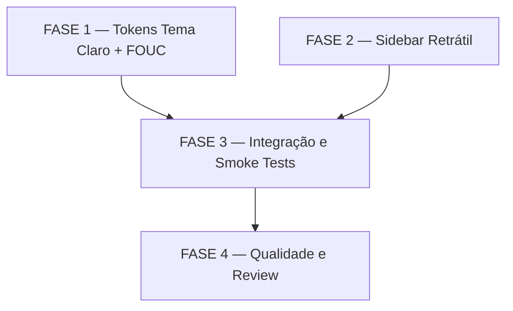

# Tarefas: tema-claro-menu-retratil

Escopo: Tema claro funcional com switch operacional + sidebar retrátil com modo
icon-only. Feature puramente front-end: `tokens.css`, `Sidebar.tsx`,
`index.html`. Zero impacto em back-end ou API.

Ref: [spec.md](spec.md) | [plan.md](plan.md) | [research.md](research.md) | [checklists/ux.md](checklists/ux.md)

**Legenda de status:**
- `[ ]` Pendente
- `[~]` Em andamento
- `[x]` Concluído
- `[!]` Bloqueado

**Legenda de criticidade:**
- `[C]` Crítico — bloqueante para entrega
- `[A]` Alto — funcionalidade core sem a qual a feature não opera
- `[M]` Médio — necessário mas adiável sem impacto na operação básica

---

## FASE 1 — Fundação: Gaps de Requisito e Tokens CSS de Tema Claro

> Fecha os 2 gaps abertos do checklist (CHK024, CHK025) como pré-condição
> para a implementação, e implementa os tokens CSS do tema claro (FR-001)
> e o script anti-FOUC (FR-003/SC-003).

### 1.1 Fechar gaps de requisito do checklist `[A]`

Ref: checklists/ux.md CHK024, CHK025

- [x] 1.1.1 Registrar como premissa aceita que o projeto é uso interno single-user; documentar que WCAG AA (4.5:1) é o critério de contraste adotado para SC-001 adicionando nota inline ao spec.md §SC-001
- [x] 1.1.2 Definir os atributos ARIA do botão de colapso/expansão da sidebar: `aria-label="Recolher menu"` / `"Expandir menu"`, `aria-expanded={!collapsed}`, e documentar como FR-016 em spec.md §Requirements
- [x] 1.1.3 Validar que a paleta light definida no research.md §Decision 2 atinge razão ≥ 4.5:1 para texto principal (`--text-0` sobre `--bg-0`): calcular via ferramenta de contraste e anotar resultado na research.md §Decision 2

### 1.2 Implementar tokens CSS do tema claro `[A]`

Ref: spec.md FR-001, FR-005, FR-006; plan.md §Phase 1 tokens.css; research.md §Decision 2

- [x] 1.2.1 Adicionar bloco `[data-theme="light"] { ... }` imediatamente após `:root { ... }` em `apps/web/src/styles/tokens.css` com os 13 tokens de superfície, texto e borda da tabela do research.md §Decision 2
- [x] 1.2.2 Garantir que os tokens semânticos (`--success`, `--warning`, `--critical`, `--info`, `--inprogress` e variantes `-soft`), de modelo (`--model-*`) e de score (`--score-*`) NÃO aparecem no bloco `[data-theme="light"]` — permanecem invariantes no `:root`
- [x] 1.2.3 Atualizar regra de scrollbar thumb em `tokens.css` para o tema claro: dentro de `[data-theme="light"]`, sobrescrever o seletor `::-webkit-scrollbar-thumb` com cor correspondente ao nível `--bg-3` claro
- [ ] 1.2.4 Verificar manualmente que `data-theme="light"` aplicado ao `<html>` no DevTools resulta em fundo e texto invertidos (smoke test visual antes de qualquer commit)

### 1.3 Script anti-FOUC no index.html `[A]`

Ref: spec.md FR-003, SC-003; plan.md §index.html anti-FOUC; research.md §Decision 5

- [x] 1.3.1 Inserir o script IIFE inline no `<head>` de `apps/web/index.html`, antes do primeiro `<link>`, lendo `localStorage` com `try/catch` e aplicando `document.documentElement.dataset.theme`
- [x] 1.3.2 Incluir o fallback `window.matchMedia('(prefers-color-scheme: dark)')` dentro do mesmo bloco `try` para o caso de `localStorage` vazio (FR-004)
- [ ] 1.3.3 Testar o anti-FOUC: definir `cstk-theme=light` no DevTools > Application > Local Storage, recarregar com Network throttling em "Slow 3G" e confirmar que não há flash do tema escuro antes da carga

---

## FASE 2 — Sidebar Retrátil

> Implementa os dois estados (expandido/colapsado) da sidebar com animação,
> tooltips, persistência e adaptação dinâmica do layout (FR-007 a FR-015).

### 2.1 Estado colapsado: CSS e tokens `[A]`

Ref: spec.md FR-007, FR-008, FR-012; plan.md §tokens.css estado colapsado

- [x] 2.1.1 Adicionar variável `--sidebar-width-collapsed: 52px` ao bloco `:root` em `tokens.css`
- [x] 2.1.2 Implementar bloco `.sidebar--collapsed` em `tokens.css` com: `width: var(--sidebar-width-collapsed)`, `transition: width 0.2s ease` (deve estar também na regra base `.sidebar`), ocultação de labels (`.nav-item span`, `.nav-label`, `.brand-name`, `.brand-tag`) e padding ajustado no `.sidebar-foot`
- [x] 2.1.3 Implementar regra `.app:has(.sidebar--collapsed) { grid-template-columns: var(--sidebar-width-collapsed) 1fr; }` em `tokens.css` para adaptação dinâmica do layout (FR-012) sem prop-drilling
- [x] 2.1.4 Confirmar que `.nav-item.active::before` (barra âmbar) permanece visível no modo colapsado — a pseudo-element usa `left: -10px` e pode precisar de ajuste para `left: 0` ou similar quando colapsado (FR-010)
- [x] 2.1.5 Garantir que `.nav-item` em modo colapsado fica centralizado (`justify-content: center; padding: 8px 0`) e que o ícone tem width/height explícitos para não encolher

### 2.2 Tooltips CSS puro no modo colapsado `[A]`

Ref: spec.md FR-009; plan.md §tokens.css tooltip CSS puro; research.md §Decision 4

- [x] 2.2.1 Implementar regra CSS para `.nav-item[data-tooltip]::after` em `tokens.css`: `content: attr(data-tooltip)`, posicionado à direita do ícone, inicialmente `opacity: 0`, com `transition: opacity 0.15s`
- [x] 2.2.2 Implementar ativação do tooltip apenas no modo colapsado: `.sidebar--collapsed .nav-item[data-tooltip]:hover::after { opacity: 1; }` — tooltip não deve aparecer no modo expandido (label já visível)
- [x] 2.2.3 Verificar que o tooltip não extrapola a viewport quando a sidebar está colapsada à esquerda; ajustar `z-index: 100` e `pointer-events: none`

### 2.3 Sidebar.tsx — collapsed state, botão e persistência `[A]`

Ref: spec.md FR-007, FR-008, FR-011, FR-013, FR-014; plan.md §Sidebar.tsx

- [x] 2.3.1 Adicionar estado `collapsed: boolean` ao `Sidebar.tsx` inicializado de `localStorage.getItem('cstk-sidebar-collapsed') === 'true'` (com fallback `false`)
- [x] 2.3.2 Adicionar `useEffect` que persiste `collapsed` em `localStorage.setItem('cstk-sidebar-collapsed', String(collapsed))` quando o estado muda
- [x] 2.3.3 Aplicar classe CSS dinamicamente no `<aside>`: `className={\`sidebar\${collapsed ? ' sidebar--collapsed' : ''}\`}`
- [x] 2.3.4 Adicionar prop `tooltip?: string` ao componente `NavItem` e passar `data-tooltip={route.label}` em todos os itens de navegação
- [x] 2.3.5 Adicionar botão de colapso/expansão ao `Sidebar.tsx` com `aria-label` dinâmico (`"Recolher menu"` / `"Expandir menu"`), `aria-expanded={!collapsed}` e `onClick={() => setCollapsed(c => !c)}` — posicionamento: topo da sidebar ou rodapé, conforme decisão de UI
- [x] 2.3.6 No modo colapsado, o `sidebar-foot` exibe apenas o ícone de toggle de tema (sem o link textual "fonte de dados") — implementar renderização condicional (FR-014)
- [x] 2.3.7 Adicionar ícone `chevron-left`/`chevron-right` ao `Icon.tsx` se não existir, ou reutilizar ícone existente para o botão de colapso

### 2.4 Acessibilidade do botão de colapso `[A]`

Ref: spec.md FR-013, FR-016 (gap CHK024); checklists/ux.md CHK024

- [x] 2.4.1 Garantir que o botão de colapso é navegável por teclado (`tabIndex={0}`, handler `onKeyDown` para `Enter`/`Space`)
- [x] 2.4.2 Verificar que `aria-expanded` reflete corretamente o estado (true = expandido, false = colapsado)
- [ ] 2.4.3 Confirmar que o foco retorna ao botão após toggle (ou se move para o próximo elemento focável logicamente)

---

## FASE 3 — Integração: Coerência Visual e Smoke Tests

> Valida a coerência visual do tema claro em todas as telas (US3) e
> confirma que as duas features coexistem sem conflito (FR-015).

### 3.1 Auditoria visual do tema claro nas 9 telas `[A]`

Ref: spec.md US3, SC-001; checklists/ux.md CHK025

- [ ] 3.1.1 Navegar com `data-theme="light"` pelas 9 telas principais (Overview, Projects, Features, Executions, Alerts, Metrics, Tasks, Incidents, Search) e inspecionar visualmente que nenhum texto é invisível (cor sobre cor idêntica)
- [ ] 3.1.2 Verificar legibilidade do `DegradedBanner` no tema claro — fundo âmbar-suave sobre branco deve permanecer chamativo (US3/Scenario 2)
- [ ] 3.1.3 Verificar que `StatusBadge`, `ScoreChip`, `OutcomePill` e `SeverityBadge` mantêm legibilidade no tema claro — cores semânticas são fixas mas os `*-soft` backgrounds precisam contraste adequado sobre fundo claro
- [ ] 3.1.4 Verificar estados de hover/focus dos `.nav-item` e `.tb-btn` no tema claro — `--bg-hover: rgba(0,0,0,0.04)` deve ser visível sobre `--bg-0: #F4F6F9`
- [ ] 3.1.5 Verificar legibilidade do `DataFreshnessIndicator` no rodapé da sidebar compacta no tema claro (US3/Scenario 4)

### 3.2 Testes de coexistência e persistência `[A]`

Ref: spec.md FR-015, SC-006, SC-007; quickstart.md §Scenario 6

- [ ] 3.2.1 Executar Scenario 6 do quickstart.md: ativar tema claro + colapsar sidebar simultaneamente; confirmar ausência de conflito visual
- [ ] 3.2.2 Executar Scenario 2 do quickstart.md: definir tema claro, recarregar; confirmar que o tema persiste sem flash (SC-007 + anti-FOUC)
- [ ] 3.2.3 Executar Scenario 5 do quickstart.md: colapsar sidebar, recarregar; confirmar que o estado de colapso persiste (SC-006)
- [ ] 3.2.4 Executar Scenario 3 do quickstart.md: simular localStorage bloqueado; confirmar fallback gracioso sem exceção (FR-004)

### 3.3 Testes de layout e responsividade `[M]`

Ref: spec.md US2/SC7, FR-012; quickstart.md §Scenario 7

- [ ] 3.3.1 Executar Scenario 7 do quickstart.md: reduzir viewport para 900px com sidebar colapsada; confirmar que o layout não quebra e o conteúdo expande corretamente
- [ ] 3.3.2 Confirmar que a regra `.app:has(.sidebar--collapsed)` funciona corretamente — testar em Chrome, Firefox e Safari (`:has()` suporte verificado)
- [ ] 3.3.3 Verificar que a animação de `width: 0.2s ease` não causa layout thrashing — inspecionar no DevTools Performance tab

---

## FASE 4 — Revisão de Código e Qualidade

> Lint, typecheck, testes unitários e review final antes de considerar a
> feature pronta para merge.

### 4.1 Lint e typecheck `[A]`

Ref: spec.md FR-001 a FR-015; plan.md §Technical Context

- [x] 4.1.1 Executar `npm run typecheck` em `apps/web/` e corrigir qualquer erro de tipo introduzido pelas modificações em `Sidebar.tsx`
- [x] 4.1.2 Executar `npm run lint` em `apps/web/` e corrigir avisos de ESLint (especialmente: `aria-*` props ausentes, `onClick` sem `onKeyDown`)
- [x] 4.1.3 Confirmar que `npm run build` (tsc + vite build) completa sem erros

### 4.2 Testes unitários `[M]`

Ref: plan.md §Technical Context (vitest); spec.md SC-004, SC-005

- [x] 4.2.1 Adicionar teste unitário vitest para `Sidebar.tsx`: verificar que com `collapsed=true`, a classe `sidebar--collapsed` está no DOM
- [x] 4.2.2 Adicionar teste unitário para a lógica de `localStorage`: com `cstk-sidebar-collapsed=true`, o estado inicial é `collapsed=true`
- [x] 4.2.3 Adicionar teste unitário para verificar que todos os 10 `NavItem`s recebem `data-tooltip` com o label correto quando `collapsed=true`
- [x] 4.2.4 Executar `vitest run` e confirmar que todos os testes passam (incluindo `PipelineProgress.test.ts` existente)

### 4.3 Validação de renderização de docs `[M]`

Ref: checklists/ux.md geral; plan.md §Project Structure

- [x] 4.3.1 Confirmar que os novos blocos CSS em `tokens.css` não quebram nenhum seletor já existente — `grep -n "data-theme"` no CSS gerado pelo Vite build
- [ ] 4.3.2 Confirmar que o script anti-FOUC no `index.html` é válido (sem erro de parsing HTML): abrir DevTools > Console após carga e verificar ausência de erros de sintaxe

---

## Matriz de Dependências

> FASE 1 e FASE 2 são paralelas — tokens do tema claro e sidebar retrátil
> são implementações ortogonais que podem ser executadas em qualquer ordem.
> FASE 3 depende de ambas (testa coexistência). FASE 4 é o gate final.

---

## Resumo Quantitativo

| Fase | Tarefas | Subtarefas | Criticidade Dominante |
|------|---------|------------|-----------------------|
| 1 — Tokens Tema Claro + FOUC | 3 | 10 | Alto `[A]` |
| 2 — Sidebar Retrátil | 4 | 18 | Alto `[A]` |
| 3 — Integração e Smoke Tests | 3 | 12 | Alto `[A]` / Médio `[M]` |
| 4 — Qualidade e Review | 3 | 9 | Alto `[A]` / Médio `[M]` |
| **Total** | **13** | **49** | — |

---

## Escopo Coberto

| Item | Descrição | Fase |
|------|-----------|------|
| FR-001 | Tokens CSS `[data-theme="light"]` completos | 1 |
| FR-002 | Switch funcional (efeito do `data-theme` já existia) | 1 |
| FR-003, SC-003 | Anti-FOUC via script inline | 1 |
| FR-004 | Fallback `prefers-color-scheme` | 1 |
| FR-005, FR-006 | Invariância de cores semânticas e de score | 1 |
| FR-007, FR-008 | Sidebar expandida/colapsada com animação | 2 |
| FR-009 | Tooltips CSS puro no modo colapsado | 2 |
| FR-010 | Indicador de item ativo visível no modo colapsado | 2 |
| FR-011 | Persistência do estado de colapso | 2 |
| FR-012 | Layout reage dinamicamente via CSS `:has()` | 2 |
| FR-013, FR-014 | Botão de colapso acessível; toggle de tema no modo colapsado | 2 |
| FR-015 | Coexistência tema claro + colapsado | 3 |
| FR-016 | Acessibilidade ARIA do botão de colapso (gap CHK024) | 2 |
| SC-001 (WCAG AA ref) | Critério de contraste documentado (gap CHK025) | 1 |
| SC-004 a SC-007 | Smoke tests de persistência e layout | 3 |

## Escopo Excluído

| Item | Descrição | Motivo |
|------|-----------|--------|
| Back-end / API | Nenhuma modificação em `apps/server/` | Feature é pure front-end; zero impacto na API |
| E2E automatizado | Playwright/Cypress não configurados | Sem framework E2E no projeto; smoke tests manuais via quickstart.md são suficientes para uso interno |
| Tema claro em charts/sparklines (SVG inline) | Charts em `charts.tsx` não usam CSS custom properties para cores | Cores de charts são hardcoded no SVG/canvas; tema claro não as afeta no MVP |
| `packages/shared-types` | Nenhum tipo novo criado | Feature não adiciona entidades de dados |
| Temas adicionais (high contrast, sepia) | Spec define apenas dark/light | Fora do escopo desta feature |
